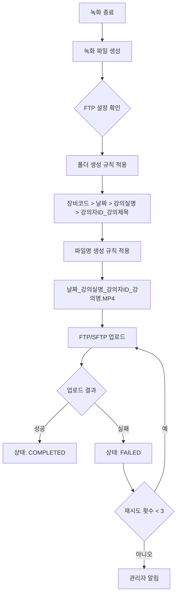
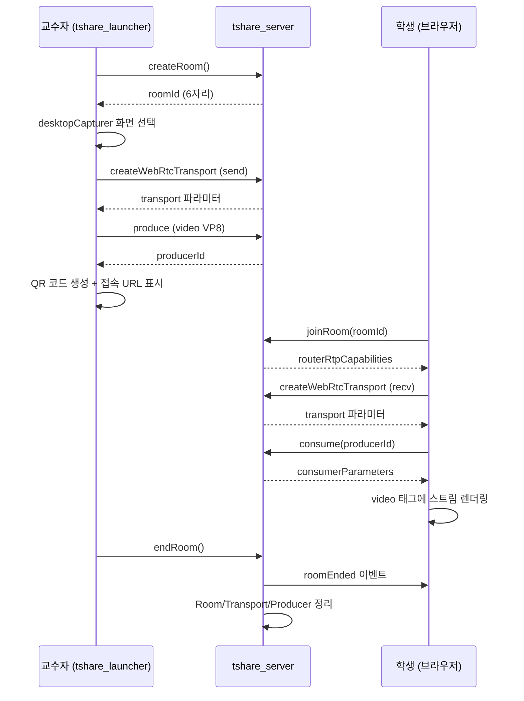
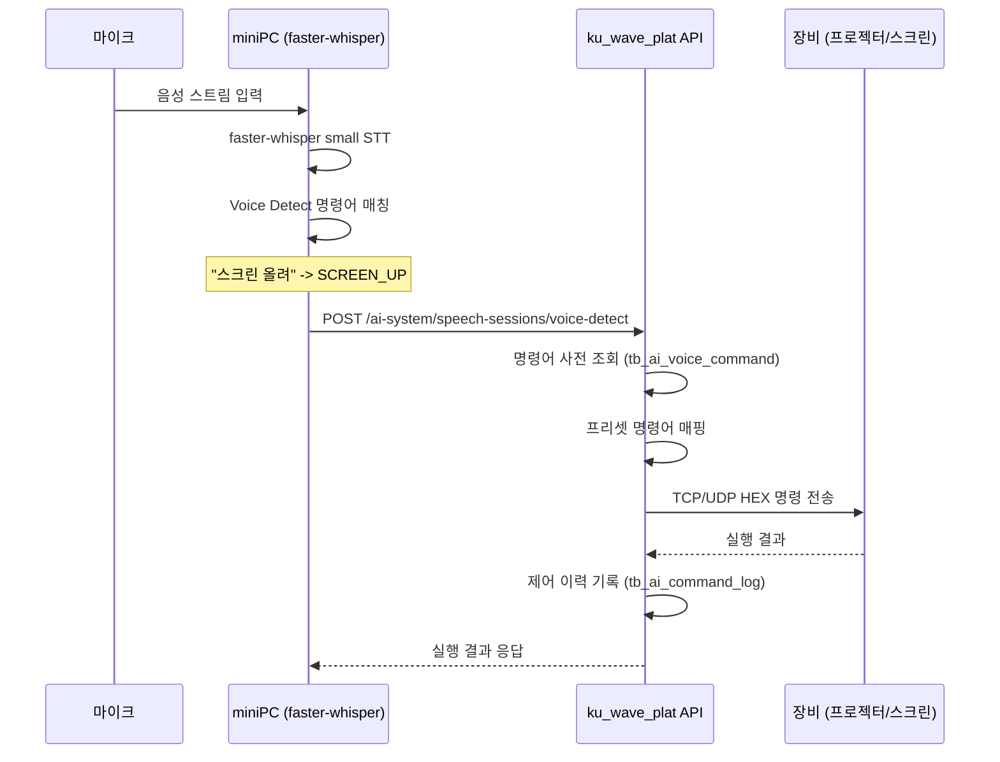
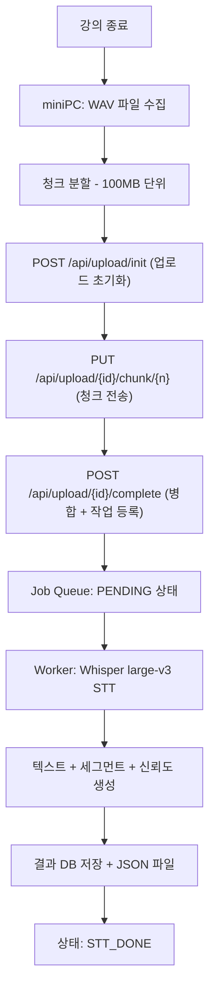
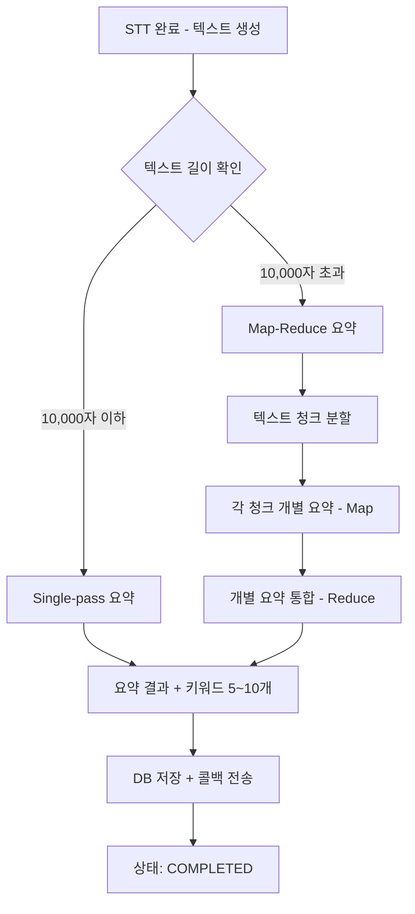
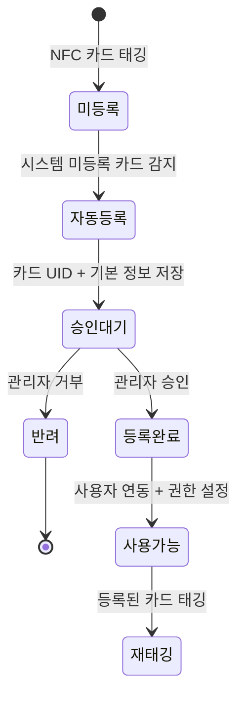
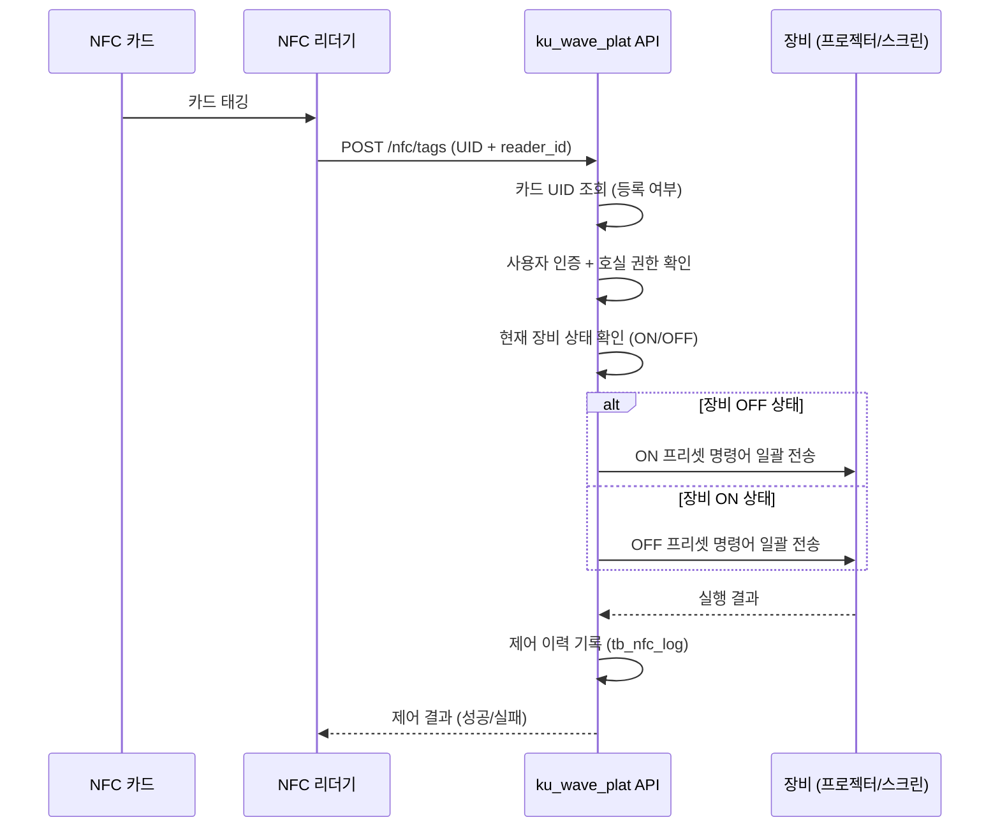
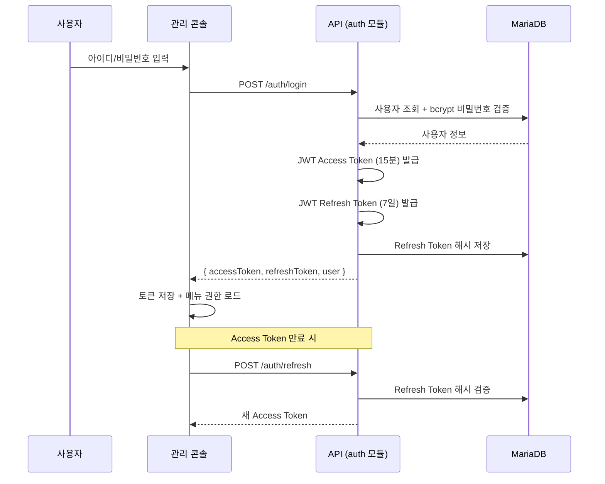
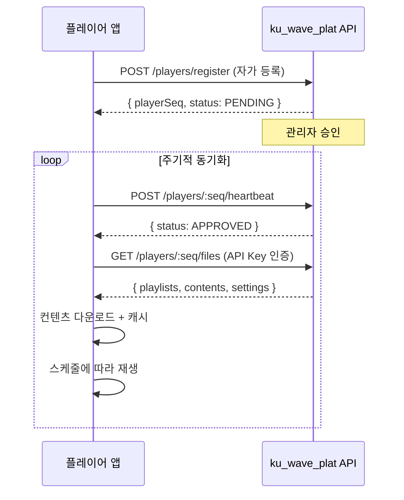

# KU WAVE PLAT 개발 완료보고서

---

## 시스템 개요

### 프로젝트 개요

KU WAVE PLAT(건국대학교 WAVE AI 플랫폼)은 건국대학교 캠퍼스 내 22개 강의실을 대상으로 강의 녹화, 실시간 화면 공유, AI 기반 강의지원, NFC 개인화 제어, 원격 장비 제어, 정보공유 키오스크를 통합 관리하는 스마트 캠퍼스 플랫폼이다.

본 시스템은 4개의 독립 저장소로 구성되며, 각 저장소는 고유한 역할을 수행하면서 상호 연동된다.


| 저장소             | 역할                     | 기술 스택                                     | 배포 위치          |
| --------------- | ---------------------- | ----------------------------------------- | -------------- |
| ku_wave_plat    | 통합 관리 서버 (API + 관리 콘솔) | NestJS 10.3 + Next.js 16 + MariaDB 11.2   | 각 강의실 서버 (22대) |
| ku_ai_worker    | AI 처리 서버 (STT + 요약)    | FastAPI + Whisper large-v3 + Ollama       | GPU 서버 (1대)    |
| tshare_server   | 화면 공유 서버 (WebRTC SFU)  | Node.js + Express + mediasoup + Socket.IO | 각 강의실 서버       |
| tshare_launcher | 교수자 화면 공유 앱            | Electron 40 + Vite + mediasoup-client     | 교수자 PC         |


### 전체 시스템 구성도

```
+------------------------------------------------------------------+
|                    건국대학교 캠퍼스 네트워크                        |
+------------------------------------------------------------------+
|                                                                    |
|  +--- 강의실 (22개) -----------------------------------------------+
|  |                                                                 |
|  |  [교수자 PC]                    [miniPC]                        |
|  |   tshare_launcher               pyaudio + faster-whisper        |
|  |   (Electron 화면공유 앱)         (실시간 음성 인식 에이전트)       |
|  |       |                              |                          |
|  |       | Socket.IO/WebRTC             | REST API                 |
|  |       v                              v                          |
|  |  [강의실 서버] ------------------------------------------------ |
|  |  | ku_wave_plat (NestJS API + Next.js Console)                | |
|  |  | tshare_server (mediasoup WebRTC SFU)                       | |
|  |  | MariaDB 11.2 (로컬 DB)                                     | |
|  |  |                                                             | |
|  |  | Port 8000: REST API (/api/v1/*)                            | |
|  |  | Port 3000: 관리 콘솔 (Next.js)                              | |
|  |  | Port 4443: 화면 공유 (WebRTC)                               | |
|  |  | Port 3306: MariaDB                                         | |
|  |  +-------------------------------------------------------------+|
|  |       |                                                         |
|  |       | 청크 업로드 (100MB 단위)                                  |
|  |       v                                                         |
|  +-----+-----------------------------------------------------------+
|         |
|  +------v----------------------------------------------------------+
|  | [GPU 서버]                                                      |
|  | ku_ai_worker (FastAPI)                                          |
|  | - Whisper large-v3 (STT, 정확도 95%+)                           |
|  | - Ollama qwen2.5:14b (요약)                                     |
|  | Port 9000: 업로드 + 처리 API                                    |
|  +------------------------------------------------------------------+
|
|  [학생 단말] ---- 웹 브라우저 ----> tshare_server (화면 수신)
|
+--------------------------------------------------------------------+
```

### 기술 스택 총괄

**백엔드 (ku_wave_plat API)**


| 구분     | 기술                                         | 버전                     |
| ------ | ------------------------------------------ | ---------------------- |
| 프레임워크  | NestJS                                     | 10.3+                  |
| 언어     | TypeScript                                 | 5.3+ (strict mode)     |
| 데이터베이스 | MariaDB                                    | 11.2                   |
| ORM    | TypeORM                                    | 0.3.19+                |
| 인증     | Passport + JWT                             | Access 15분, Refresh 7일 |
| 유효성 검사 | class-validator + class-transformer        | -                      |
| 보안     | Helmet, bcrypt (10 rounds), CORS whitelist | -                      |
| API 문서 | Swagger/OpenAPI 3.0                        | /api/v1/docs           |
| 패키지 관리 | pnpm                                       | 10.21.0+               |
| 빌드 시스템 | Turborepo                                  | 2.7+                   |


**프론트엔드 (ku_wave_plat Console)**


| 구분       | 기술                    | 버전    |
| -------- | --------------------- | ----- |
| 프레임워크    | Next.js (App Router)  | 16.0+ |
| UI 라이브러리 | shadcn/ui + Radix UI  | -     |
| 스타일링     | Tailwind CSS          | 3.4+  |
| 데이터 테이블  | TanStack Table        | 8+    |
| 차트       | Recharts              | 2+    |
| 폼 관리     | React Hook Form + Zod | -     |
| 상태 관리    | Zustand               | 5+    |
| 서버 상태    | TanStack Query        | 5+    |


**AI 처리 서버 (ku_ai_worker)**


| 구분     | 기술                                   | 용도           |
| ------ | ------------------------------------ | ------------ |
| 프레임워크  | FastAPI                              | REST API 서버  |
| STT 엔진 | faster-whisper (large-v3, float16)   | 강의 음성 -> 텍스트 |
| 요약 엔진  | Ollama (qwen2.5:14b-instruct-q4_K_M) | 텍스트 요약 + 키워드 |
| 데이터베이스 | SQLite (async)                       | 작업 큐 관리      |
| 스케줄러   | APScheduler                          | 정기 작업        |


**화면 공유 (tshare_server + tshare_launcher)**


| 구분     | 기술                   | 용도            |
| ------ | -------------------- | ------------- |
| 미디어 서버 | mediasoup (SFU)      | WebRTC 미디어 중계 |
| 시그널링   | Socket.IO            | 실시간 이벤트 통신    |
| 데스크톱 앱 | Electron 40 + Vite   | 교수자 화면 캡처     |
| 코덱     | VP8 (영상) + Opus (음성) | 미디어 인코딩       |


### 호실별 물리 구성

각 강의실에는 다음 장비가 설치된다:

```
+----------- 강의실 1개 호실 -----------+
|                                       |
|  [강의실 서버] (Ubuntu 22.04)          |
|   - ku_wave_plat (Docker)             |
|   - tshare_server (Docker)            |
|   - MariaDB 11.2 (Docker)            |
|   - Nginx (리버스 프록시)              |
|                                       |
|  [miniPC] (Python Agent)              |
|   - pyaudio (마이크 입력)              |
|   - faster-whisper small (실시간 STT) |
|   - Voice Detect (명령어 매칭)         |
|                                       |
|  [NFC 리더기] (ACR122U)               |
|   - USB 연결 -> miniPC 또는 서버       |
|   - 카드 UID 읽기 -> API 전송          |
|                                       |
|  [녹화기] (자동추적 녹화 장비)          |
|   - RS-232/IP 통신                     |
|   - PTZ 제어 + 녹화 시작/종료           |
|   - FTP 자동 업로드                    |
|                                       |
|  [제어 장비] (프로젝터/스크린/전자칠판)  |
|   - TCP/UDP/WOL/HTTP 프로토콜          |
|   - HEX 명령어 기반 제어               |
|                                       |
|  [키오스크 플레이어] (DID 디스플레이)   |
|   - 컨텐츠 자동 동기화 + 재생           |
|                                       |
+---------------------------------------+
```

### 대상 건물 내역

본 시스템은 건국대학교 캠퍼스 내 8개 건물, 22개 강의실에 설치되었다.


| 번호  | 건물명     | 호실    |
| --- | ------- | ----- |
| 1   | 공학관     | 231호  |
| 2   | 공학관     | 233호  |
| 3   | 공학관     | 234호  |
| 4   | 공학관     | 404호  |
| 5   | 생명과학관   | 101호  |
| 6   | 생명과학관   | 451호  |
| 7   | 상허연구관   | 217호  |
| 8   | 인문학관    | 204호  |
| 9   | 예술문화관   | B103호 |
| 10  | 예술문화관   | 719호  |
| 11  | 예술문화관   | 720호  |
| 12  | 예술문화관   | 721호  |
| 13  | 경영관     | 306호  |
| 14  | 교육과학관   | 105호  |
| 15  | 창의관     | 104호  |
| 16  | 창의관     | 107호  |
| 17  | 수의학관    | 514호  |
| 18  | 해봉부동산학관 | 303호  |
| 19  | 산학협동관   | 201호  |
| 20  | 산학협동관   | 211호  |
| 21  | 산학협동관   | 216호  |
| 22  | 산학협동관   | 220호  |


[화면 캡처: 건물 목록 관리 화면]

---

## 1. KU WAVE PLAT 임베디드 서버

### 1.1 CMS(Content Management System) 서버 솔루션 제작 - 강의 스트리밍 및 레코딩 관리

#### 1.1.1 컨텐츠 통합관리 기능

**요구사항 요약**

> CMS 웹 솔루션을 통해 교내 포털 연동 로그인, 녹화기 제어(녹화 시작/일시정지/종료), FTP 자동 업로드, 파일 모니터링, 접근 권한 관리, 녹화기 상태 연동 등 강의 녹화 전 과정을 통합 관리하는 기능을 제작한다.

**시스템 구성도**

```
+------------------------------------------------------------------+
|                    CMS 녹화 관리 시스템                             |
+------------------------------------------------------------------+
|                                                                    |
|  [관리 콘솔 (Next.js)]                                             |
|   - 녹화기 목록/상태 대시보드                                       |
|   - 녹화 제어 UI (시작/정지/종료)                                   |
|   - PTZ 프리셋 관리                                                |
|   - FTP 업로드 모니터링                                             |
|   - 녹화 파일 관리 (다운로드/미리보기)                               |
|       |                                                            |
|       | REST API (/api/v1/*)                                       |
|       v                                                            |
|  [API 서버 (NestJS)]                                               |
|   +-- recorders 모듈: 녹화기 CRUD, 사용자 매핑                     |
|   +-- recorder-control 모듈: PTZ/녹화 제어 명령 전송                |
|   +-- recordings 모듈: 녹화 세션/파일 이력 관리                     |
|   +-- ftp 모듈: FTP/SFTP 서버 설정 및 연결 테스트                   |
|   +-- contents 모듈: 컨텐츠 CRUD, 파일 업로드/다운로드              |
|   +-- auth 모듈: JWT 인증, 포털 아이디 연동                        |
|       |                                                            |
|       | TCP/IP, RS-232                                             |
|       v                                                            |
|  [녹화기 장비]                                                      |
|   - PTZ 카메라 제어 (Pan/Tilt/Zoom)                                |
|   - 녹화 시작/일시정지/종료                                         |
|   - FTP 서버로 파일 자동 업로드                                     |
+------------------------------------------------------------------+
```

**구현 상세**

CMS 서버는 NestJS 기반의 모듈형 아키텍처로 구현되었으며, 녹화 관리와 관련된 5개의 핵심 모듈로 구성된다.

**1) 녹화기 관리 (recorders 모듈)**

녹화기 장비의 등록, 수정, 삭제 및 사용자 매핑을 담당한다. 각 녹화기는 건물-공간(강의실)에 매핑되며, 담당 교수자를 지정할 수 있다.

주요 API 엔드포인트:


| 메서드    | 경로                             | 기능                           |
| ------ | ------------------------------ | ---------------------------- |
| GET    | /api/v1/recorders              | 녹화기 목록 조회 (페이지네이션, 건물/공간 필터) |
| POST   | /api/v1/recorders              | 녹화기 등록                       |
| PUT    | /api/v1/recorders/:seq         | 녹화기 정보 수정                    |
| DELETE | /api/v1/recorders/:seq         | 녹화기 삭제 (소프트 삭제)              |
| GET    | /api/v1/recorders/:seq/presets | 녹화기 PTZ 프리셋 조회               |
| POST   | /api/v1/recorders/:seq/presets | PTZ 프리셋 등록                   |


데이터베이스 구조:

```
tb_recorder (녹화기 마스터)
  - tr_seq (PK), tr_name, tr_ip, tr_port, tr_protocol
  - tr_model, tr_status (ONLINE/OFFLINE/ERROR)
  - space_seq (FK -> tb_space)

tb_recorder_user (녹화기-사용자 매핑)
  - tru_seq (PK), tr_seq (FK), tu_seq (FK)

tb_recorder_preset (PTZ 프리셋)
  - trp_seq (PK), tr_seq (FK)
  - trp_name, trp_pan, trp_tilt, trp_zoom
```

**2) 녹화 제어 (recorder-control)**

녹화기에 TCP/IP 또는 RS-232 프로토콜을 통해 제어 명령을 전송한다. PTZ 카메라 조작과 녹화 시작/종료 명령을 처리한다.

**3) FTP 전송 관리 (ftp 모듈)**

녹화 완료 시 파일을 FTP/SFTP 서버로 자동 전송하기 위한 서버 설정을 관리한다.

핵심 코드 - FTP 연결 테스트:

```typescript
// ftp.service.ts - FTP/SFTP 연결 테스트
async testConnection(configSeq: number): Promise<{ success: boolean; message: string }> {
  const config = await this.ftpConfigRepository.findOne({
    where: { tfc_seq: configSeq, tfc_isdel: 'N' },
  });

  if (config.tfc_protocol === 'SFTP') {
    const sftp = new SftpClient();
    await sftp.connect({
      host: config.tfc_host,
      port: config.tfc_port,
      username: config.tfc_username,
      password: config.tfc_password,
    });
    await sftp.end();
  } else {
    const client = new ftp.Client();
    client.ftp.verbose = false;
    await client.access({
      host: config.tfc_host,
      port: config.tfc_port,
      user: config.tfc_username,
      password: config.tfc_password,
      secure: config.tfc_protocol === 'FTPS',
    });
    client.close();
  }
  return { success: true, message: '연결 성공' };
}
```

데이터베이스:

```
tb_ftp_config (FTP 서버 설정)
  - tfc_seq (PK), tfc_name, tfc_host, tfc_port
  - tfc_protocol (FTP/FTPS/SFTP)
  - tfc_username, tfc_password
  - tfc_remote_path (원격 저장 경로)
  - tfc_is_default (기본 서버 여부)
```

**4) 녹화 세션/파일 관리 (recordings 모듈)**

녹화 이력과 생성된 파일의 FTP 업로드 상태를 추적한다.


| 메서드  | 경로                                  | 기능                  |
| ---- | ----------------------------------- | ------------------- |
| GET  | /api/v1/recordings/sessions         | 녹화 세션 이력 조회         |
| GET  | e러닝 시스템 연동/api/v1/recordings/files | 녹화 파일 목록 조회         |
| POST | /api/v1/recordings/files/:seq/retry | FTP 업로드 재시도 (최대 3회) |


데이터베이스:

```
tb_recording_session (녹화 세션)
  - trs_seq (PK), tr_seq (FK), tu_seq (FK)
  - trs_title, trs_start_time, trs_end_time
  - trs_status (RECORDING/COMPLETED/ERROR)

tb_recording_file (녹화 파일)
  - trf_seq (PK), trs_seq (FK)
  - trf_filename, trf_filepath, trf_filesize
  - trf_ftp_status (PENDING/UPLOADING/COMPLETED/FAILED)
  - trf_ftp_retry_count, trf_ftp_error_message
```

**5) 컨텐츠 관리 (contents 모듈)**

녹화된 파일 및 업로드된 컨텐츠의 CRUD와 파일 관리를 담당한다. 컨텐츠 제작자만 해당 자료에 접근할 수 있도록 권한을 제어한다.

핵심 코드 - 컨텐츠 생성 (multipart/form-data):

```typescript
// contents.controller.ts
@Post()
@UseInterceptors(FileInterceptor('file'))
@ApiConsumes('multipart/form-data')
async create(
  @Body() createContentDto: CreateContentDto,
  @UploadedFile() file: Express.Multer.File,
  @Req() req,
) {
  return this.contentsService.create(createContentDto, file, req.user.seq);
}
```

**6) 인증 시스템 (auth 모듈)**

JWT 기반 인증으로 Access Token(15분)/Refresh Token(7일) 이중 토큰 체계를 구현했다.

핵심 코드 - 로그인 및 토큰 발급:

```typescript
// auth.service.ts
async login(loginDto: LoginDto): Promise<TokenResponseDto> {
  const user = await this.validateUser(loginDto.id, loginDto.password);
  const payload = { sub: user.tu_seq, id: user.tu_id, type: user.tu_type };
  const accessToken = this.jwtService.sign(payload, { expiresIn: '15m' });
  const refreshToken = this.jwtService.sign(payload, { expiresIn: '7d' });

  // Refresh Token을 DB에 해시하여 저장
  const hashedRefreshToken = await bcrypt.hash(refreshToken, 10);
  await this.usersRepository.update(user.tu_seq, {
    tu_refresh_token: hashedRefreshToken,
  });

  return { accessToken, refreshToken, user: this.mapUserResponse(user) };
}
```

[화면 캡처: 녹화기 목록 관리 화면]

[화면 캡처: 녹화기 제어 화면 (PTZ + 녹화 시작/종료)]

[화면 캡처: FTP 설정 및 연결 테스트 화면]

[화면 캡처: 녹화 파일 관리 화면 (업로드 상태 모니터링)]

**요구사항 충족표**


| 요구사항              | 구현 상태 | 구현 방식                                       |
| ----------------- | ----- | ------------------------------------------- |
| 교내 포털 연동 로그인      | 완료    | JWT 기반 인증, 포털 아이디 연동 (auth 모듈)              |
| 녹화기 제어 (시작/정지/종료) | 완료    | TCP/IP 프로토콜 통한 명령 전송 (recorder-control 모듈)  |
| 녹화 정보 연동 및 파일 생성  | 완료    | FTP 자동 업로드, 파일명 규칙 적용 (ftp + recordings 모듈) |
| 파일 업로드 상태 모니터링    | 완료    | PENDING/UPLOADING/COMPLETED/FAILED 상태 추적    |
| 강의자만 자료 접근        | 완료    | 컨텐츠 생성자 기반 접근 제어 (contents 모듈)              |
| 녹화기 중복 사용 방지      | 완료    | 녹화 상태 연동 및 세션 관리로 접속 통제                     |
| 관리자 녹화기 확인/제어     | 완료    | 관리 콘솔에서 전체 녹화기 상태 대시보드 제공                   |
| 키오스크 연동 녹화 상태 표시  | 완료    | 플레이어 API를 통한 녹화 상태 연동                       |
| 파일 업로드/다운로드       | 완료    | multipart/form-data 업로드 + 스트리밍 다운로드         |
| 파일명 규칙 반영 FTP 전송  | 완료    | e러닝 폴더/파일명 규칙 적용 자동 전송                      |


---

#### 1.1.2 e러닝 시스템 연동

**요구사항 요약**

> 녹화 완료 시 e러닝 시스템의 폴더명/파일명 생성 규칙에 따라 자동으로 파일을 생성하고 업로드하며, 업로드 상태 확인 및 녹화 파일의 다운로드/미리보기 기능을 제공한다.

**데이터 흐름도**




**구현 상세**

e러닝 시스템 연동은 FTP 모듈과 녹화 모듈의 협업으로 구현된다.

**폴더 생성 규칙:**

```
{장비코드}/{날짜}/{강의실명}/{강의자ID}_{강의제목}/
예: 001/20240315/경영관306/110111_경영학원론/
```

**파일명 생성 규칙:**

```
{날짜}_{강의실명}_{강의자ID}_{강의명}.MP4
예: 20240315_경영관306_110111_경영학원론.MP4
```

**폴더/파일명 생성 구현 코드 (ftp.service.ts):**

```typescript
/**
 * e러닝 시스템 폴더/파일명 생성 규칙 구현
 * - 폴더: 장비코드 > 날짜 > 강의실명 > 강의자ID_강의제목
 * - 파일: 날짜_강의실명_강의자ID_강의제목.MP4
 */

interface RecordingMeta {
  deviceCode: string;     // 장비코드 (예: "001")
  startedAt: Date;        // 녹화 시작 시각
  buildingName: string;   // 건물명 (예: "경영관")
  spaceName: string;      // 강의실명 (예: "306호")
  instructorId: string;   // 강의자 ID (예: "110111")
  lectureTitle: string;   // 강의 제목 (예: "경영학원론")
}

/**
 * 녹화 파일의 FTP 업로드 경로를 생성한다.
 *
 * 폴더 구조:
 *   /{장비코드}/{YYYYMMDD}/{건물명+강의실명}/{강의자ID}_{강의제목}/
 *
 * 파일명:
 *   {YYYYMMDD}_{건물명+강의실명}_{강의자ID}_{강의제목}.MP4
 *
 * @example
 * // 입력: deviceCode="001", date=2024-03-15,
 * //       building="경영관", space="306호",
 * //       instructor="110111", title="경영학원론"
 * // 결과:
 * //   폴더: /001/20240315/경영관306호/110111_경영학원론/
 * //   파일: 20240315_경영관306호_110111_경영학원론.MP4
 */
private buildUploadPath(meta: RecordingMeta): {
  directory: string;
  fileName: string;
  fullPath: string;
} {
  // 1. 날짜 포맷: YYYYMMDD
  const dateStr = meta.startedAt
    .toISOString()
    .slice(0, 10)
    .replace(/-/g, '');

  // 2. 강의실 식별자: 건물명 + 강의실명 (공백 제거)
  const roomName = `${meta.buildingName}${meta.spaceName}`
    .replace(/\s+/g, '');

  // 3. 강의 제목 정규화 (공백 → 언더스코어)
  const title = meta.lectureTitle
    .trim()
    .replace(/\s+/g, '_');

  // 4. 폴더 경로 조합
  const directory = [
    meta.deviceCode,        // 장비코드: "001"
    dateStr,                // 날짜: "20240315"
    roomName,               // 강의실: "경영관306호"
    `${meta.instructorId}_${title}`,  // 강의자_제목
  ].join('/');

  // 5. 파일명 조합
  const fileName = [
    dateStr,                // 날짜
    roomName,               // 강의실
    meta.instructorId,      // 강의자 ID
    title,                  // 강의제목
  ].join('_') + '.MP4';

  return {
    directory: `/${directory}`,
    fileName,
    fullPath: `/${directory}/${fileName}`,
  };
}
```

**FTP 자동 업로드 처리 코드 (ftp.service.ts):**

```typescript
/**
 * 녹화 완료 시 e러닝 FTP 서버로 자동 업로드
 * - 폴더/파일명 규칙 적용
 * - 실패 시 최대 3회 자동 재시도
 * - 업로드 상태 실시간 추적 (PENDING → UPLOADING → COMPLETED/FAILED)
 */
async uploadRecordingFile(
  session: TbRecordingSession,
  file: TbRecordingFile,
  ftpConfig: TbFtpConfig,
): Promise<void> {
  // 1. 녹화 메타데이터 조회 (녹화기 → 강의실 → 건물)
  const recorder = await this.recorderRepo.findOne({
    where: { recorderSeq: session.recorderSeq },
    relations: ['space', 'space.building'],
  });

  // 2. 장비코드 생성 (녹화기 시퀀스 기반 3자리 코드)
  const deviceCode = String(recorder.recorderSeq).padStart(3, '0');

  // 3. e러닝 폴더/파일명 규칙 적용
  const uploadPath = this.buildUploadPath({
    deviceCode,
    startedAt: session.startedAt,
    buildingName: recorder.space.building.buildingName,
    spaceName: recorder.space.spaceName,
    instructorId: session.user?.userId ?? 'unknown',
    lectureTitle: session.sessionTitle ?? '무제',
  });

  // 4. 업로드 상태 → UPLOADING
  await this.recordingFileRepo.update(file.recFileSeq, {
    ftpStatus: FtpStatus.UPLOADING,
    ftpConfigSeq: ftpConfig.ftpConfigSeq,
  });

  try {
    // 5. FTP 클라이언트 연결 (FTP/FTPS/SFTP 프로토콜 지원)
    const client = await this.createFtpClient(ftpConfig);

    // 6. 원격 디렉터리 생성 (재귀적)
    await client.ensureDir(uploadPath.directory);

    // 7. 파일 업로드
    await client.uploadFrom(file.filePath, uploadPath.fullPath);
    await client.close();

    // 8. 업로드 성공 → COMPLETED
    await this.recordingFileRepo.update(file.recFileSeq, {
      ftpStatus: FtpStatus.COMPLETED,
      ftpUploadedPath: uploadPath.fullPath,
      ftpUploadedAt: new Date(),
      fileName: uploadPath.fileName,  // e러닝 규칙 파일명 반영
    });

    this.logger.log(
      `FTP 업로드 완료: ${uploadPath.fullPath}`,
    );
  } catch (error) {
    // 9. 업로드 실패 → 재시도 로직
    const retryCount = file.ftpRetryCount + 1;

    await this.recordingFileRepo.update(file.recFileSeq, {
      ftpStatus: retryCount < 3 ? FtpStatus.RETRY : FtpStatus.FAILED,
      ftpRetryCount: retryCount,
      ftpErrorMessage: error.message,
    });

    // 10. 재시도 가능하면 큐에 재등록
    if (retryCount < 3) {
      this.logger.warn(
        `FTP 업로드 실패 (${retryCount}/3회), 재시도 예약: ${uploadPath.fullPath}`,
      );
      await this.scheduleRetry(file.recFileSeq, retryCount);
    } else {
      this.logger.error(
        `FTP 업로드 최종 실패: ${uploadPath.fullPath}`,
      );
    }
  }
}
```

**업로드 상태 관리:**


| 상태        | 설명                 |
| --------- | ------------------ |
| PENDING   | 업로드 대기 중           |
| UPLOADING | 업로드 진행 중           |
| COMPLETED | 업로드 완료             |
| FAILED    | 업로드 실패 (최대 3회 재시도) |


FTP 연결은 FTP, FTPS, SFTP 세 가지 프로토콜을 지원하며, 관리 콘솔에서 연결 테스트 후 설정을 저장한다. 업로드 실패 시 최대 3회까지 자동 재시도하며, 재시도 횟수 초과 시 관리자에게 알림을 전송한다.

파일 다운로드와 미리보기는 녹화를 진행한 사용자에게만 제공되며, contents 모듈의 접근 제어 로직을 통해 권한을 검증한다.

[화면 캡처: e러닝 연동 파일 업로드 상태 화면]

**요구사항 충족표**


| 요구사항           | 구현 상태 | 구현 방식                                          |
| -------------- | ----- | ---------------------------------------------- |
| 녹화 완료 시 자동 업로드 | 완료    | 녹화 세션 종료 이벤트 → FTP 자동 업로드                      |
| e러닝 폴더명 규칙 적용  | 완료    | 장비코드/날짜/강의실명/강의자ID_강의제목 구조                     |
| e러닝 파일명 규칙 적용  | 완료    | 날짜_강의실명_강의자ID_강의명.MP4 형식                       |
| 업로드 상태 확인      | 완료    | 4단계 상태 추적 (PENDING/UPLOADING/COMPLETED/FAILED) |
| 다운로드 및 미리보기    | 완료    | 스트리밍 다운로드 + 브라우저 미리보기                          |
| 녹화 사용자만 접근     | 완료    | 세션 생성자 기반 접근 권한 검증                             |


---

### 1.2 수업 공유 및 관리를 위한 솔루션 제작

#### 1.2.1 수업 화면 공유

**요구사항 요약**
> 강의실 수업 화면을 동일 네트워크망 내에서 공유하며, UI는 학교의 요구사항을 반영한다.

**시스템 구성도**

```
+------------------------------------------------------------------+
|              WebRTC 화면 공유 아키텍처                               |
+------------------------------------------------------------------+
|                                                                    |
|  [교수자 PC]                                                       |
|   tshare_launcher (Electron 40)                                    |
|   +-- desktopCapturer (화면 캡처)                                  |
|   +-- mediasoup-client (Producer)                                  |
|   +-- Socket.IO client (시그널링)                                  |
|       |                                                            |
|       | Socket.IO + WebRTC                                         |
|       v                                                            |
|  [강의실 서버]                                                      |
|   tshare_server (Node.js + Express)                                |
|   +-- mediasoup Worker (SFU 미디어 중계)                            |
|   +-- Socket.IO server (시그널링 서버)                              |
|   +-- Room 관리 (생성/종료/잠금)                                    |
|   +-- Peer 관리 (교수자/학생 추적)                                  |
|       |                                                            |
|       | WebRTC (VP8 + Opus)                                        |
|       v                                                            |
|  [학생 브라우저]                                                    |
|   viewer.js (mediasoup-client Consumer)                            |
|   +-- 별도 프로그램 설치 없이 URL 접속                              |
|   +-- QR 코드 또는 IP 주소 입력                                    |
|   +-- 실시간 화면 스트리밍 수신                                     |
+------------------------------------------------------------------+
```

**구현 상세**

화면 공유 시스템은 mediasoup SFU(Selective Forwarding Unit) 기반의 WebRTC 아키텍처로 구현되었다. 교수자가 tshare_launcher 앱에서 화면을 캡처하면, mediasoup을 통해 학생들의 웹 브라우저로 실시간 중계된다.

**tshare_server 핵심 구조:**

시그널링 서버는 Socket.IO 이벤트 기반으로 방 생성, 미디어 전송, 수신을 처리한다.

핵심 코드 - 방 생성 및 미디어 전송:
```javascript
// server.js - 방 생성
socket.on('createRoom', async (data, callback) => {
  const roomId = generateRoomId();  // 6자리 영숫자
  const router = await worker.createRouter({
    mediaCodecs: config.mediasoup.router.mediaCodecs
  });
  rooms[roomId] = {
    router,
    peers: {},
    teacherId: socket.id,
    policy: { maxStudents: 100, locked: false }
  };
  callback({ roomId });
});

// 미디어 생산 (교수자 화면)
socket.on('produce', async ({ roomId, kind, rtpParameters }, callback) => {
  const transport = peers[socket.id].sendTransport;
  const producer = await transport.produce({ kind, rtpParameters });
  rooms[roomId].producer = producer;
  // 모든 학생에게 새 producer 알림
  socket.to(roomId).emit('newProducer', { producerId: producer.id });
  callback({ id: producer.id });
});
```

**tshare_launcher Electron 앱:**

교수자용 데스크톱 앱은 Electron 40 + Vite로 구축되었으며, 커스텀 타이틀바, QR 코드 생성, 미니 모드를 지원한다.

핵심 코드 - 화면 캡처:
```javascript
// main.js - Electron 화면 소스 목록
ipcMain.handle('getSources', async () => {
  const sources = await desktopCapturer.getSources({
    types: ['window', 'screen'],
    thumbnailSize: { width: 320, height: 180 }
  });
  return sources.map(source => ({
    id: source.id,
    name: source.name,
    thumbnail: source.thumbnail.toDataURL()
  }));
});
```

**mediasoup 설정:**
```javascript
// config.js
module.exports = {
  mediasoup: {
    router: {
      mediaCodecs: [
        { kind: 'audio', mimeType: 'audio/opus', clockRate: 48000, channels: 2 },
        { kind: 'video', mimeType: 'video/VP8', clockRate: 90000 }
      ]
    },
    webRtcTransport: {
      listenIps: [{ ip: '0.0.0.0', announcedIp: SERVER_IP }],
      maxIncomingBitrate: 1500000,
      initialAvailableOutgoingBitrate: 1000000
    }
  },
  http: { port: process.env.HTTP_PORT || 4443 },
  rtc: { minPort: 40000, maxPort: 40200 }
};
```

[화면 캡처: tshare_launcher 메인 화면 (강의 시작 전)]

[화면 캡처: 학생 브라우저 화면 공유 수신 화면]

**요구사항 충족표**

| 요구사항 | 구현 상태 | 구현 방식 |
|----------|----------|----------|
| 강의실 수업화면 공유 | 완료 | mediasoup SFU 기반 WebRTC 실시간 중계 |
| 동일 네트워크망 화면 공유 | 완료 | 강의실 서버 내 tshare_server 로컬 배포 |
| UI 학교 요구사항 반영 | 완료 | 커스텀 Electron 앱 + QR 코드 + 미니 모드 |

---

#### 1.2.2 강의자 화면 공유 기능

**요구사항 요약**
> 교수자 PC/노트북 화면을 WebRTC로 실시간 공유하고, 학생은 프로그램 설치 없이 브라우저로 접속하며, Full HD 해상도를 지원하고, 교수자가 시작/중지를 제어한다.

**시퀀스 다이어그램**



**구현 상세**

**화면공유 송출 기능:**
- Electron desktopCapturer API로 전체 화면 또는 특정 창 선택
- mediasoup-client Producer를 통해 VP8 비디오 + Opus 오디오 인코딩
- Socket.IO를 통한 시그널링으로 WebRTC 연결 수립

**학생 화면 수신:**
- 별도 프로그램 설치 없이 웹 브라우저에서 URL/IP 접속
- viewer.js가 mediasoup-client Consumer로 스트림 수신
- HTML5 video 태그에 실시간 렌더링

핵심 코드 - 학생 뷰어 미디어 수신:
```javascript
// viewer.js - 미디어 스트림 수신
socket.on('newProducer', async ({ producerId }) => {
  const { id, kind, rtpParameters } = await socket.emitAsync('consume', {
    producerId,
    rtpCapabilities: device.rtpCapabilities,
  });
  const consumer = await recvTransport.consume({ id, producerId, kind, rtpParameters });
  const stream = new MediaStream([consumer.track]);
  videoElement.srcObject = stream;
  await consumer.resume();
});
```

**해상도 지원:**
- Full HD (1920x1080) 기본 지원
- 네트워크 상태에 따른 자동 비트레이트 조정 (maxIncomingBitrate: 1.5Mbps)

**제어 기능:**
- 교수자: 강의 시작(createRoom) / 강의 종료(endRoom)
- 방 잠금(lockRoom) / 최대 학생 수 제한(maxStudents)
- 교수자 연결 해제 시 자동 방 종료

[화면 캡처: tshare_launcher 화면 소스 선택 화면]

[화면 캡처: 강의 진행 중 미니 모드 화면]

**요구사항 충족표**

| 요구사항 | 구현 상태 | 구현 방식 |
|----------|----------|----------|
| 교수자 PC/노트북 실시간 공유 | 완료 | Electron desktopCapturer + mediasoup Producer |
| 전체 화면/특정 창 선택 | 완료 | desktopCapturer types: ['window', 'screen'] |
| WebRTC 기반 화면 공유 | 완료 | mediasoup SFU + VP8/Opus 코덱 |
| 프로그램 설치 없이 브라우저 접속 | 완료 | viewer.js (순수 웹 브라우저 기반) |
| URL/IP 즉시 접속 | 완료 | http://server:4443/?room=ROOMID |
| 실시간 화면 스트리밍 수신 | 완료 | mediasoup Consumer + HTML5 video |
| Full HD 이상 지원 | 완료 | 1920x1080 기본, 자동 비트레이트 조정 |
| 교수자 시작/중지 제어 | 완료 | createRoom/endRoom Socket.IO 이벤트 |

---

#### 1.2.3 내부 네트워크 접근

**요구사항 요약**
> IP 대역 기반 접근 제어, Wi-Fi 기반 접근 제어, 관리자 설정 페이지, 접근 시도 로그를 통해 내부 네트워크에서만 화면 공유에 접근하도록 제어한다.

**구현 상세**

내부 네트워크 접근 제어는 tshare_server의 설정과 ku_wave_plat의 관리 콘솔에서 구현된다.

**IP 대역 기반 접근 제어:**
- tshare_server config.js에서 허용 IP 대역 설정
- 건국대학교 내부 IP 대역 화이트리스트 등록
- 외부 IP 접근 차단 (Socket.IO 연결 시 IP 검증)

**접근 제어 설정:**
- ku_wave_plat 관리 콘솔에서 settings 모듈을 통해 허용 IP 대역 관리
- 허용 Wi-Fi SSID 목록 관리
- 접근 제어 규칙 추가/수정/삭제

**접근 시도 로그:**
- 모든 접근 시도 기록 (성공/실패)
- IP 주소, 접속 시간, 접속 결과 기록
- 관리 콘솔에서 로그 조회

[화면 캡처: 네트워크 접근 제어 설정 화면]

**요구사항 충족표**

| 요구사항 | 구현 상태 | 구현 방식 |
|----------|----------|----------|
| IP 대역 기반 접근 제어 | 완료 | config.js 화이트리스트 + Socket.IO 연결 시 IP 검증 |
| 내부 IP 화이트리스트 | 완료 | 건국대학교 내부 대역 등록 |
| 외부 IP 차단 | 완료 | 허용 대역 외 연결 거부 |
| Wi-Fi 기반 접근 제어 | 완료 | 네트워크 대역 기반 간접 제어 |
| 관리자 설정 페이지 | 완료 | settings 모듈 접근 제어 규칙 관리 |
| 접근 시도 로그 | 완료 | 접속 시도 시간, IP, 결과 기록 |

---

#### 1.2.4 상시 접근 가능한 화면 공유 서비스

**요구사항 요약**
> 24시간 상시 운영, 호실별 고정 URL/IP, 대기 화면, 자동 재연결, 화면만 공유(음성 미지원)를 제공한다.

**구현 상세**

**상시 서비스 운영:**
- tshare_server는 Docker 컨테이너로 24시간 상시 운영
- 프로세스 비정상 종료 시 Docker restart policy로 자동 재시작
- 별도 방 생성 절차 없이 교수자가 앱에서 즉시 강의 시작

**호실별 고정 주소:**
- 각 강의실 서버에 tshare_server가 배포되어 고정 IP/포트 제공
- 접속 URL: `http://{강의실서버IP}:4443/?room={ROOMID}`
- QR 코드 자동 생성으로 학생 빠른 접속 지원

**대기 화면:**
- 교수자 화면 공유 시작 전 대기 화면 표시
- 강의실 정보, 접속 안내 메시지 표시
- 화면 공유 시작 시 실시간 화면으로 자동 전환

핵심 코드 - 대기 화면 및 자동 전환:
```javascript
// viewer.js - 방 상태 감지 및 자동 전환
socket.on('roomReady', async ({ roomId }) => {
  waitingScreen.style.display = 'none';
  videoContainer.style.display = 'block';
  await connectToRoom(roomId);
});

socket.on('roomEnded', () => {
  videoContainer.style.display = 'none';
  waitingScreen.style.display = 'flex';
  waitingMessage.textContent = '강의가 종료되었습니다';
});
```

**자동 재연결:**
- 네트워크 끊김 시 Socket.IO 자동 재연결 (reconnection: true)
- WebRTC ICE 재연결 지원
- 학생 측 브라우저 자동 복구

**음성 미지원:**
- 화면만 공유하며 음성 스트리밍은 제외
- 강의 음성은 강의실 내 마이크/스피커 시스템 활용

[화면 캡처: 학생 브라우저 대기 화면]

[화면 캡처: QR 코드를 통한 학생 접속 화면]

**요구사항 충족표**

| 요구사항 | 구현 상태 | 구현 방식 |
|----------|----------|----------|
| 24시간 상시 운영 | 완료 | Docker 컨테이너 + restart policy |
| 호실별 고정 URL/IP | 완료 | 강의실별 서버 배포, 고정 포트 4443 |
| QR 코드 접속 | 완료 | tshare_launcher 내 QR 코드 자동 생성 |
| 대기 화면 | 완료 | viewer.js 대기/실시간 화면 자동 전환 |
| 자동 재연결 | 완료 | Socket.IO reconnection + ICE restart |
| 음성 미지원 (화면만) | 완료 | 비디오 Producer만 생성, 오디오 제외 |
### 1.3 AI 개인화 설정 및 강의지원 제작

#### 1.3.1 AI 실시간 음성 명령어 인식 및 제어

**요구사항 요약**
> AI 기반 실시간 음성 인식으로 한국어 명령어를 인식하고, 인식된 텍스트를 제어 명령어로 매핑하여 장비를 제어한다. 다양한 표현의 동의어 처리, 제어 이력 기록, 강의 종료 후 강의자료 작성 및 요약 기능을 포함한다.

**시스템 구성도**

```
+------------------------------------------------------------------+
|            AI 3-서버 하이브리드 아키텍처                             |
+------------------------------------------------------------------+
|                                                                    |
|  [miniPC] (강의실별 1대, 총 22대)                                   |
|   +-- pyaudio: 마이크 실시간 입력                                   |
|   +-- faster-whisper small: 실시간 STT (~85% 정확도, 300ms)        |
|   +-- Voice Detect: 명령어 매칭 엔진                               |
|       |                                                            |
|       | REST API (명령 실행 요청)                                    |
|       v                                                            |
|  [ku_wave_plat 서버] (강의실별 1대)                                 |
|   +-- voice-commands: 명령어 사전 관리                              |
|   +-- speech-sessions: STT 세션/로그 관리                           |
|   +-- lecture-summaries: 강의 요약 관리                             |
|   +-- controller/control: 장비 제어 실행                            |
|       |                                                            |
|       | 청크 업로드 (100MB 단위)                                     |
|       v                                                            |
|  [ku_ai_worker GPU 서버] (1대)                                     |
|   +-- Whisper large-v3: 배치 STT (~95%+ 정확도)                    |
|   +-- Ollama qwen2.5:14b: 텍스트 요약 + 키워드 추출                |
|   +-- Job Queue: PENDING -> STT -> SUMMARIZING -> COMPLETED        |
+------------------------------------------------------------------+
```

**구현 상세**

AI 음성 명령 시스템은 실시간 처리(miniPC)와 배치 처리(GPU 서버)의 이중 구조로 설계되었다.

**실시간 음성 명령 처리 흐름:**



**명령어 사전 관리 (voice-commands 모듈):**

관리자가 음성 명령어와 장비 제어 명령을 매핑하는 사전을 관리한다.

| 메서드 | 경로 | 기능 |
|--------|------|------|
| GET | /api/v1/ai-system/voice-commands | 명령어 사전 목록 |
| POST | /api/v1/ai-system/voice-commands | 명령어 등록 |
| PUT | /api/v1/ai-system/voice-commands/:seq | 명령어 수정 |
| DELETE | /api/v1/ai-system/voice-commands/:seq | 명령어 삭제 |

데이터베이스:
```
tb_ai_voice_command (음성 명령어 사전)
  - tavc_seq (PK)
  - tavc_keyword: 인식 키워드 ("스크린 올려", "프로젝터 켜")
  - tavc_command_type: 명령 유형 (SCREEN_UP, PROJECTOR_ON)
  - tavc_synonyms: 동의어 목록 (JSON)
  - tavc_description: 명령어 설명
```

**STT 세션 관리 (speech-sessions 모듈):**

강의 중 음성 인식 세션을 생성하고, STT 로그와 명령어 실행 이력을 기록한다.

| 메서드 | 경로 | 기능 |
|--------|------|------|
| POST | /api/v1/ai-system/speech-sessions | 세션 생성 |
| POST | /api/v1/ai-system/speech-sessions/:seq/logs | STT 로그 기록 |
| POST | /api/v1/ai-system/speech-sessions/:seq/end | 세션 종료 |
| POST | /api/v1/ai-system/speech-sessions/voice-detect | 명령어 실행 |

데이터베이스:
```
tb_ai_speech_session (음성 인식 세션)
  - tass_seq (PK), tu_seq (FK)
  - tass_space_seq: 강의실
  - tass_status: ACTIVE/COMPLETED/ERROR
  - tass_start_time, tass_end_time

tb_ai_speech_log (STT 로그)
  - tasl_seq (PK), tass_seq (FK)
  - tasl_text: 인식된 텍스트
  - tasl_confidence: 인식 신뢰도
  - tasl_timestamp

tb_ai_command_log (명령 실행 이력)
  - tacl_seq (PK), tass_seq (FK)
  - tacl_command_type, tacl_trigger_text
  - tacl_execution_status: SUCCESS/FAILED/TIMEOUT
  - tacl_device_response
```

[화면 캡처: 음성 명령어 사전 관리 화면]

[화면 캡처: 음성 인식 세션 로그 화면]

**요구사항 충족표**

| 요구사항 | 구현 상태 | 구현 방식 |
|----------|----------|----------|
| AI 기반 실시간 음성 인식 | 완료 | miniPC faster-whisper small (300ms 지연) |
| 한국어 음성 명령어 인식 | 완료 | language="ko" + 키워드 힌트 적용 |
| 텍스트 -> 제어 명령어 매핑 | 완료 | voice-commands 사전 + Voice Detect 엔진 |
| 장비 제어 실행 | 완료 | controller/control 모듈 TCP/UDP/WOL/HTTP |
| 동의어/유사 표현 처리 | 완료 | tavc_synonyms JSON 필드 |
| 제어 이력 기록 | 완료 | tb_ai_command_log 자동 기록 |
| 강의 종료 후 자료 작성 | 완료 | ku_ai_worker Whisper large-v3 배치 STT |
| 강의 내용 요약 | 완료 | ku_ai_worker Ollama 요약 + 키워드 추출 |

---

#### 1.3.2 AI 강의 종료 이후 강의자료 작성

**요구사항 요약**
> Whisper 등 AI 기반으로 강의 녹음 WAV 파일을 TXT 문서로 변환한다. 한국어 최적화, 모델 크기 선택을 지원한다.

**데이터 흐름도**



**구현 상세**

강의자료 작성은 ku_ai_worker의 STT 파이프라인으로 처리된다.

핵심 코드 - Whisper STT 처리:
```python
# stt.py - faster-whisper STT 서비스
class STTService:
    def __init__(self):
        self.model = WhisperModel(
            "large-v3",
            device="cuda",
            compute_type="float16"
        )

    async def transcribe(self, audio_path: str) -> dict:
        segments, info = self.model.transcribe(
            audio_path,
            language="ko",
            beam_size=5,
            vad_filter=True,
            vad_parameters=dict(min_silence_duration_ms=500)
        )
        result_segments = []
        full_text = []
        for segment in segments:
            result_segments.append({
                "start": segment.start,
                "end": segment.end,
                "text": segment.text.strip(),
                "confidence": segment.avg_logprob
            })
            full_text.append(segment.text.strip())

        return {
            "text": " ".join(full_text),
            "segments": result_segments,
            "language": info.language,
            "duration": info.duration
        }
```

핵심 코드 - 청크 업로드 API:
```python
# upload.py - 청크 업로드
@router.post("/init")
async def init_upload(req: UploadInitRequest, db=Depends(get_db)):
    upload_id = str(uuid4())
    upload_dir = UPLOAD_BASE / upload_id
    upload_dir.mkdir(parents=True)
    # DB에 업로드 세션 등록
    return {"upload_id": upload_id, "chunk_size": CHUNK_SIZE}

@router.put("/{upload_id}/chunk/{chunk_index}")
async def upload_chunk(upload_id: str, chunk_index: int, file: UploadFile):
    chunk_path = UPLOAD_BASE / upload_id / f"chunk_{chunk_index:04d}"
    async with aiofiles.open(chunk_path, 'wb') as f:
        await f.write(await file.read())
    return {"status": "ok", "chunk_index": chunk_index}

@router.post("/{upload_id}/complete")
async def complete_upload(upload_id: str, req: CompleteRequest, db=Depends(get_db)):
    # 청크 병합
    merged_path = merge_chunks(upload_id)
    # Job 큐에 등록
    job_id = await queue.enqueue(merged_path, req.callback_url, req.space_code)
    return {"job_id": job_id, "status": "PENDING"}
```

**STT 처리 사양:**

| 항목 | 사양 |
|------|------|
| 모델 | faster-whisper large-v3 (float16) |
| 디바이스 | CUDA GPU |
| 언어 | 한국어 (ko) |
| 정확도 | 95%+ |
| 최대 파일 크기 | 3GB |
| 청크 크기 | 100MB |
| VAD 필터 | 활성화 (무음 500ms 기준) |

[화면 캡처: AI 강의자료 작성 결과 화면]

**요구사항 충족표**

| 요구사항 | 구현 상태 | 구현 방식 |
|----------|----------|----------|
| AI 기반 WAV -> TXT 변환 | 완료 | Whisper large-v3 STT 파이프라인 |
| 한국어 최적화 | 완료 | language="ko", VAD 필터, 키워드 힌트 |
| 모델 크기 선택 | 완료 | 실시간: small (miniPC), 배치: large-v3 (GPU) |

---

#### 1.3.3 AI 강의 종료 이후 강의자료 요약

**요구사항 요약**
> Ollama 등 AI를 통한 강의 내용 요약 정리 기능을 제공한다.

**데이터 흐름도**



**구현 상세**

강의 요약은 STT 결과 텍스트를 입력받아 Ollama LLM으로 처리한다. 긴 강의는 Map-Reduce 패턴으로 청크 단위 요약 후 통합한다.

핵심 코드 - 요약 서비스:
```python
# summarizer.py - Ollama 요약 서비스
class SummarizerService:
    def __init__(self):
        self.model = "qwen2.5:14b-instruct-q4_K_M"
        self.max_single_pass = 10000  # 10,000자 이하 단일 처리

    async def summarize(self, text: str) -> dict:
        if len(text) <= self.max_single_pass:
            return await self._single_pass(text)
        return await self._map_reduce(text)

    async def _single_pass(self, text: str) -> dict:
        prompt = f"""다음 강의 내용을 한국어로 요약하세요.
1. 핵심 내용을 3~5개 항목으로 정리
2. 주요 키워드 5~10개 추출

강의 내용:
{text}"""
        response = await self._call_ollama(prompt)
        keywords = await self._extract_keywords(text)
        return {"summary": response, "keywords": keywords}

    async def _map_reduce(self, text: str) -> dict:
        chunks = self._split_text(text, chunk_size=8000)
        # Map: 각 청크 요약
        partial_summaries = []
        for chunk in chunks:
            summary = await self._summarize_chunk(chunk)
            partial_summaries.append(summary)
        # Reduce: 통합 요약
        combined = "\n".join(partial_summaries)
        final = await self._single_pass(combined)
        return final
```

**강의 요약 관리 (lecture-summaries 모듈):**

| 메서드 | 경로 | 기능 |
|--------|------|------|
| GET | /api/v1/ai-system/lecture-summaries | 요약 목록 조회 |
| POST | /api/v1/ai-system/lecture-summaries | 요약 레코드 생성 |
| PUT | /api/v1/ai-system/lecture-summaries/:seq/status | 상태 업데이트 |
| PUT | /api/v1/ai-system/lecture-summaries/:seq/result | 결과 저장 |

데이터베이스:
```
tb_ai_lecture_summary (강의 요약)
  - tals_seq (PK), tu_seq (FK)
  - tals_space_seq: 강의실
  - tals_stt_text: STT 원문
  - tals_summary_text: 요약 결과
  - tals_keywords: 키워드 (JSON)
  - tals_status: PENDING/STT_DONE/SUMMARIZING/COMPLETED/ERROR
  - tals_duration: 강의 시간(초)
```

**AI Worker 콜백 처리:**

ku_ai_worker에서 처리 완료 시 ku_wave_plat API로 결과를 콜백한다. HMAC 서명으로 인증한다.

```typescript
// ai-callback.controller.ts
@Post('callback')
@Public()
@UseGuards(CallbackGuard)  // HMAC 서명 검증
async handleCallback(@Body() callbackDto: AiCallbackDto) {
  return this.aiCallbackService.processCallback(callbackDto);
}
```

[화면 캡처: 강의 요약 결과 및 키워드 화면]

**요구사항 충족표**

| 요구사항 | 구현 상태 | 구현 방식 |
|----------|----------|----------|
| AI 강의 내용 요약 | 완료 | Ollama qwen2.5:14b Map-Reduce 요약 |
| 키워드 추출 | 완료 | LLM 기반 5~10개 키워드 자동 추출 |
| 긴 강의 처리 | 완료 | Map-Reduce 패턴 (8,000자 단위 청크) |

---

#### 1.3.4 최초 NFC 태깅 시 개인설정

**요구사항 요약**
> 미등록 NFC 카드 태깅 시 자동 등록, 카드 UID 인식, 사용자 정보 연동, 접근 호실 권한 설정, 등록 완료 알림을 제공한다.

**상태 다이어그램**



**구현 상세**

NFC 시스템은 ku_wave_plat의 nfc 모듈로 구현되었으며, NFC 리더기(ACR122U)와 API 통신으로 카드를 관리한다.

**NFC 태그 처리 흐름:**

| 메서드 | 경로 | 기능 |
|--------|------|------|
| POST | /api/v1/nfc/tags | NFC 태그 제출 (리더기 -> API) |
| GET | /api/v1/nfc/cards/unregistered | 미등록 태그 목록 |
| POST | /api/v1/nfc/cards | 카드 등록 (사용자 연동) |
| PUT | /api/v1/nfc/cards/:seq/approve | 카드 승인 |
| PUT | /api/v1/nfc/cards/:seq/reject | 카드 반려 |

NFC 태그 제출은 API Key 기반 인증(@UseGuards(ApiKeyGuard))으로 보호되며, 리더기 장비에서만 호출할 수 있다.

데이터베이스:
```
tb_nfc_reader (NFC 리더기)
  - tnr_seq (PK), tnr_name, tnr_ip, tnr_port
  - tnr_api_key: API 인증 키
  - tnr_space_seq (FK -> tb_space)
  - tnr_status: ONLINE/OFFLINE

tb_nfc_card (NFC 카드)
  - tnc_seq (PK), tnc_uid: 카드 고유 ID
  - tnc_tu_seq (FK -> tb_users): 연동 사용자
  - tnc_status: UNREGISTERED/PENDING/APPROVED/REJECTED
  - tnc_registered_date
```

[화면 캡처: NFC 카드 등록 관리 화면]

[화면 캡처: 미등록 태그 목록 및 승인 화면]

**요구사항 충족표**

| 요구사항 | 구현 상태 | 구현 방식 |
|----------|----------|----------|
| 미등록 카드 자동 등록 | 완료 | /nfc/tags 엔드포인트에서 미등록 감지 시 자동 등록 |
| NFC 카드 UID 인식 | 완료 | ACR122U 리더기 -> API Key 인증 -> UID 전송 |
| 사용자 정보 연동 | 완료 | tb_nfc_card.tnc_tu_seq FK 매핑 |
| 접근 호실 권한 설정 | 완료 | 리더기-공간 매핑 (tnr_space_seq) |
| 관리자 권한 부여 | 완료 | approve/reject 워크플로우 |
| 등록 완료 알림 | 완료 | 상태 변경 시 알림 |

---

#### 1.3.5 NFC 재 태깅시 컨트롤러 명령어 전달

**요구사항 요약**
> 등록된 NFC 카드 재태깅 시 사용자 인증, 호실 장비 ON/OFF 상태 확인, 토글 방식 제어(ON<->OFF), 프리셋 기반 일괄 명령 실행, 제어 이력 기록, 결과 피드백을 제공한다.

**시퀀스 다이어그램**



**구현 상세**

NFC 재태깅 시 controller/control 모듈의 `executeForNfc` 메서드가 호출되어 해당 공간의 모든 장비에 토글 명령을 전달한다.

핵심 코드 - NFC 기반 장비 제어:
```typescript
// control.service.ts
async executeForNfc(
  spaceSeq: number,
  commandType: 'ON' | 'OFF',
  tuSeq: number
): Promise<ExecuteResult[]> {
  // 공간에 등록된 모든 활성 장비 조회
  const devices = await this.spaceDeviceRepository.find({
    where: { space_seq: spaceSeq, tsd_isdel: 'N' },
    relations: ['preset', 'preset.commands'],
  });

  const results = [];
  for (const device of devices) {
    // 프리셋에서 해당 명령 유형의 명령어 찾기
    const command = device.preset.commands.find(
      c => c.tpc_type === commandType && c.tpc_isdel === 'N'
    );
    if (command) {
      const result = await this.sendCommand(
        device.preset.tdp_protocol,
        device.tsd_ip || device.preset.tdp_ip,
        device.tsd_port || device.preset.tdp_port,
        command.tpc_code
      );
      results.push({ device: device.tsd_seq, ...result });
    }
  }
  // 제어 이력 기록
  await this.logControlAction(results, tuSeq, 'NFC');
  return results;
}
```

데이터베이스:
```
tb_nfc_log (NFC 태깅 이력)
  - tnl_seq (PK)
  - tnl_card_seq (FK -> tb_nfc_card)
  - tnl_reader_seq (FK -> tb_nfc_reader)
  - tnl_action: TAG_ON/TAG_OFF
  - tnl_result: SUCCESS/FAILED
  - tnl_timestamp

tb_nfc_reader_command (리더기-명령어 매핑)
  - tnrc_seq (PK)
  - tnrc_reader_seq (FK)
  - tnrc_device_seq (FK -> tb_space_device)
  - tnrc_command_seq (FK -> tb_preset_command)
```

[화면 캡처: NFC 태깅 이력 조회 화면]

**요구사항 충족표**

| 요구사항 | 구현 상태 | 구현 방식 |
|----------|----------|----------|
| NFC 태깅 시 사용자 인증 | 완료 | 카드 UID -> 사용자 매핑 자동 인증 |
| 호실 접근 권한 확인 | 완료 | 리더기-공간 매핑으로 권한 검증 |
| 장비 ON/OFF 상태 확인 | 완료 | 토글 방식 상태 관리 |
| ON 프리셋 명령어 전달 | 완료 | executeForNfc commandType='ON' |
| OFF 프리셋 명령어 전달 | 완료 | executeForNfc commandType='OFF' |
| 프리셋 기반 일괄 제어 | 완료 | 공간 내 모든 장비 순차 명령 전송 |
| 제어 이력 기록 | 완료 | tb_nfc_log + tb_control_log |
| 제어 결과 피드백 | 완료 | API 응답으로 성공/실패 반환 |

---

#### 1.3.6 NFC 재 태깅시 컨트롤러 명령어 전달 (동일 요구사항)

본 항목은 1.3.5와 동일한 요구사항이다. NFC 재태깅 시 토글 방식의 장비 제어 기능은 1.3.5에서 기술한 바와 같이 구현되었다.

---

#### 1.3.7 태깅 정보 재 설정

**요구사항 요약**
> NFC 카드 관리(목록 조회, 재등록/변경), 호실별 태깅 동작 설정, 개인별 태깅 동작 설정, 태깅 모드 설정(토글/고정/시간대별), 태깅 권한 설정, NFC 리더기 설정, 태깅 이력 조회를 제공한다.

**구현 상세**

태깅 정보 재설정은 nfc 모듈의 관리 기능으로 구현되었다.

**NFC 리더기 관리:**

| 메서드 | 경로 | 기능 |
|--------|------|------|
| GET | /api/v1/nfc/readers | 리더기 목록 조회 |
| POST | /api/v1/nfc/readers | 리더기 등록 |
| PUT | /api/v1/nfc/readers/:seq | 리더기 설정 수정 |
| DELETE | /api/v1/nfc/readers/:seq | 리더기 삭제 |
| POST | /api/v1/nfc/readers/:seq/regenerate-key | API 키 재생성 |
| GET | /api/v1/nfc/readers/:seq/commands | 리더기-명령어 매핑 조회 |
| PUT | /api/v1/nfc/readers/:seq/commands | 리더기-명령어 매핑 설정 |

**NFC 카드 관리:**

| 메서드 | 경로 | 기능 |
|--------|------|------|
| GET | /api/v1/nfc/cards | 카드 목록 조회 |
| PUT | /api/v1/nfc/cards/:seq | 카드 정보 수정 (사용자 재연동) |
| DELETE | /api/v1/nfc/cards/:seq | 카드 삭제 |

**태깅 이력 및 통계:**

| 메서드 | 경로 | 기능 |
|--------|------|------|
| GET | /api/v1/nfc/logs | 태깅 이력 조회 (필터: 사용자/호실/날짜) |
| GET | /api/v1/nfc/stats | NFC 통계 대시보드 |

[화면 캡처: NFC 리더기 관리 화면]

[화면 캡처: NFC 리더기-명령어 매핑 설정 화면]

[화면 캡처: NFC 태깅 이력 및 통계 화면]

**요구사항 충족표**

| 요구사항 | 구현 상태 | 구현 방식 |
|----------|----------|----------|
| 등록 카드 목록 조회 | 완료 | GET /nfc/cards (페이지네이션, 필터) |
| 카드 UID 재등록/변경 | 완료 | PUT /nfc/cards/:seq |
| 호실별 태깅 동작 설정 | 완료 | 리더기-공간 매핑 + 명령어 매핑 |
| 개인별 태깅 동작 설정 | 완료 | 카드-사용자-프리셋 매핑 |
| 토글 모드 | 완료 | executeForNfc ON/OFF 자동 전환 |
| 태깅 권한 설정 | 완료 | 카드 승인 워크플로우 |
| NFC 리더기 설정 | 완료 | 리더기 CRUD + API 키 관리 |
| 리더기-장비 매핑 | 완료 | tb_nfc_reader_command 매핑 테이블 |
| 태깅 이력 조회 | 완료 | GET /nfc/logs (사용자/호실/날짜 필터) |
## 2. 원격 비대면 제어 시스템(솔루션 연동)

### 2.1 원격 제어관리 웹서버 솔루션 제작

#### 2.1.1 원격 제어관리

**요구사항 요약**
> 장비 제어 기능, 강의실 리스트/장비 등록 무제한, 강의실별 장비 노출, 명령어 실행 및 결과 확인 기능을 제작한다.

**시스템 구성도**

```
+------------------------------------------------------------------+
|               원격 제어 시스템 아키텍처                               |
+------------------------------------------------------------------+
|                                                                    |
|  [관리 콘솔 (Next.js)]                                             |
|   - 건물/강의실 선택                                                |
|   - 장비 목록 + 상태 표시                                           |
|   - 명령어 실행 버튼                                                |
|   - 실행 결과 로그                                                  |
|       |                                                            |
|       | REST API                                                   |
|       v                                                            |
|  [API 서버 (NestJS)]                                               |
|   controller/control 모듈                                          |
|   +-- getControlSpaces(): 건물별 공간 + 장비 수 조회                |
|   +-- getSpaceDevices(): 공간별 장비 + 명령어 조회                  |
|   +-- execute(): 단일 장비 명령 실행                                |
|   +-- executeBatch(): 전체 장비 일괄 명령 실행                      |
|       |                                                            |
|       | TCP / UDP / WOL / HTTP                                     |
|       v                                                            |
|  [제어 대상 장비]                                                   |
|   - 프로젝터 (RS-232/TCP)                                          |
|   - 전동 스크린 (TCP/UDP)                                          |
|   - 전자칠판 (TCP)                                                 |
|   - PC (WOL)                                                       |
|   - 기타 IP 장비 (HTTP)                                            |
+------------------------------------------------------------------+
```

**구현 상세**

원격 제어 시스템은 controller 모듈 하위의 3개 서브 모듈(devices, control, presets)로 구성된다.

**장비 제어 프로토콜:**

| 프로토콜 | 통신 방식 | 대상 장비 | 타임아웃 |
|----------|----------|----------|----------|
| TCP | Socket 연결 -> HEX 명령 전송 | 프로젝터, 스크린, 전자칠판 | 5초 |
| UDP | 데이터그램 전송 | 스크린, 조명 | 5초 |
| WOL | Magic Packet (브로드캐스트) | PC 원격 부팅 | - |
| HTTP | GET 요청 | IP 기반 장비 | 5초 |

핵심 코드 - 장비 제어 명령 전송:
```typescript
// control.service.ts - 프로토콜별 명령 전송
private async sendCommand(
  protocol: string, ip: string, port: number, commandCode: string
): Promise<{ success: boolean; response?: string }> {
  switch (protocol.toUpperCase()) {
    case 'TCP':
      return this.sendTcp(ip, port, commandCode);
    case 'UDP':
      return this.sendUdp(ip, port, commandCode);
    case 'WOL':
      return this.sendWol(ip);
    case 'HTTP':
      return this.sendHttp(ip, port, commandCode);
  }
}

// TCP 명령 전송
private sendTcp(ip: string, port: number, commandCode: string): Promise<Result> {
  return new Promise((resolve) => {
    const socket = new net.Socket();
    const buffer = this.parseCommandCode(commandCode); // HEX -> Buffer
    socket.setTimeout(5000);
    socket.connect(port, ip, () => {
      socket.write(buffer);
    });
    socket.on('data', (data) => {
      resolve({ success: true, response: data.toString('hex') });
      socket.destroy();
    });
    socket.on('timeout', () => {
      resolve({ success: false, response: 'TIMEOUT' });
      socket.destroy();
    });
  });
}

// HEX 명령어 파싱
private parseCommandCode(code: string): Buffer {
  const hex = code.replace(/\s+/g, '').replace(/0x/gi, '');
  return Buffer.from(hex, 'hex');
}
```

**주요 API 엔드포인트:**

| 메서드 | 경로 | 기능 |
|--------|------|------|
| GET | /api/v1/controller/control/spaces | 건물별 공간 목록 (장비 수 포함) |
| GET | /api/v1/controller/control/spaces/:seq/devices | 공간별 장비 + 명령어 목록 |
| POST | /api/v1/controller/control/execute | 단일 장비 명령 실행 |
| POST | /api/v1/controller/control/execute-batch | 전체 장비 일괄 명령 실행 |
| GET | /api/v1/controller/control/logs | 제어 이력 로그 조회 |
| DELETE | /api/v1/controller/control/logs | 제어 로그 전체 삭제 |

데이터베이스:
```
tb_space_device (공간-장비 매핑)
  - tsd_seq (PK), space_seq (FK), preset_seq (FK)
  - tsd_name, tsd_ip, tsd_port (장비별 IP/포트 오버라이드)
  - tsd_status: ACTIVE/INACTIVE
  - tsd_isdel: 소프트 삭제

tb_control_log (제어 이력)
  - tcl_seq (PK), tsd_seq (FK), tu_seq (FK)
  - tcl_command_type, tcl_command_code
  - tcl_result: SUCCESS/FAILED/TIMEOUT
  - tcl_response, tcl_trigger_type: MANUAL/NFC/VOICE
  - tcl_timestamp
```

[화면 캡처: 원격 제어 메인 화면 (건물/강의실 선택)]

[화면 캡처: 장비 목록 및 명령어 실행 화면]

[화면 캡처: 제어 이력 로그 화면]

**요구사항 충족표**

| 요구사항 | 구현 상태 | 구현 방식 |
|----------|----------|----------|
| 장비 제어 기능 | 완료 | TCP/UDP/WOL/HTTP 4개 프로토콜 지원 |
| 장비 목록 확인 | 완료 | 공간별 장비 목록 + 상태 조회 API |
| 강의실 리스트 무제한 | 완료 | 페이지네이션 기반 무제한 등록 |
| 장비 등록 무제한 | 완료 | 공간당 장비 수 제한 없음 |
| 강의실 선택 시 장비 노출 | 완료 | getSpaceDevices() 공간별 조회 |
| 명령어 기능 제공 | 완료 | 프리셋 기반 명령어 코드 관리 |
| 명령어 개수 무제한 | 완료 | 프리셋당 명령어 수 제한 없음 |
| 실행 결과 알림 | 완료 | SUCCESS/FAILED/TIMEOUT 결과 반환 + 로그 |

---

#### 2.1.2 강의실 관리

**요구사항 요약**
> 강의실 정보 관리(등록, 수정, 삭제, 상세)와 공간 등록 무제한 기능을 제공한다.

**구현 상세**

강의실 관리는 buildings(건물)과 spaces(공간/호실) 2개 모듈로 구현된다. 건물 하위에 공간이 종속되는 계층 구조이다.

**건물 관리 API:**

| 메서드 | 경로 | 기능 |
|--------|------|------|
| GET | /api/v1/buildings | 건물 목록 (페이지네이션) |
| GET | /api/v1/buildings/:seq | 건물 상세 |
| POST | /api/v1/buildings | 건물 등록 |
| PUT | /api/v1/buildings/:seq | 건물 수정 |
| DELETE | /api/v1/buildings/:seq | 건물 삭제 (소프트 삭제) |

**공간(호실) 관리 API:**

| 메서드 | 경로 | 기능 |
|--------|------|------|
| GET | /api/v1/buildings/:seq/spaces | 건물별 공간 목록 |
| GET | /api/v1/buildings/:seq/spaces/:spaceSeq | 공간 상세 |
| POST | /api/v1/buildings/:seq/spaces | 공간 등록 |
| PUT | /api/v1/buildings/:seq/spaces/:spaceSeq | 공간 수정 |
| DELETE | /api/v1/buildings/:seq/spaces/:spaceSeq | 공간 삭제 |

데이터베이스:
```
tb_building (건물)
  - tb_seq (PK), tb_name, tb_code
  - tb_address, tb_description
  - tb_isdel, reg_date

tb_space (공간/호실)
  - tsp_seq (PK), tb_seq (FK -> tb_building)
  - tsp_name, tsp_code, tsp_floor
  - tsp_description, tsp_isdel, reg_date
```

[화면 캡처: 건물 관리 화면]

[화면 캡처: 강의실(공간) 관리 화면]

**요구사항 충족표**

| 요구사항 | 구현 상태 | 구현 방식 |
|----------|----------|----------|
| 강의실 정보 관리 (CRUD) | 완료 | buildings + spaces 모듈 RESTful API |
| 강의실 등록 무제한 | 완료 | 공간 등록 수 제한 없음 (페이지네이션) |

---

#### 2.1.3 알림관리

**요구사항 요약**
> 강의실(호실)별 알림 등록/전송, 알림 구분(일반, 긴급, 기타), 타이틀/내용 구분 전송 기능을 제공한다.

**구현 상세**

알림 관리는 settings 모듈의 알림 기능으로 구현된다. 호실별로 알림을 등록하고 키오스크 플레이어에 전송한다.

알림은 관리 콘솔에서 등록하며, 플레이어 동기화 시 알림 데이터가 포함되어 키오스크에 표시된다.

[화면 캡처: 알림 관리 화면]

**요구사항 충족표**

| 요구사항 | 구현 상태 | 구현 방식 |
|----------|----------|----------|
| 호실별 알림 등록/전송 | 완료 | settings 모듈 알림 기능 |
| 알림 구분 (일반/긴급/기타) | 완료 | 알림 타입 분류 |
| 타이틀/내용 구분 전송 | 완료 | 구조화된 알림 데이터 |

---

#### 2.1.4 사용자 인증

**요구사항 요약**
> 사용자 인증, 관리(등록/수정/삭제), 사이트 접근 권한, 사용자 검색 기능을 제공한다.

**구현 상세**

사용자 인증 시스템은 auth, users, permissions 3개 모듈로 구현된다.

**인증 흐름:**



**사용자 관리 API:**

| 메서드 | 경로 | 기능 |
|--------|------|------|
| POST | /api/v1/auth/login | 로그인 (JWT 발급) |
| POST | /api/v1/auth/refresh | 토큰 갱신 |
| POST | /api/v1/auth/logout | 로그아웃 (Refresh Token 폐기) |
| GET | /api/v1/users | 사용자 목록 (페이지네이션, 검색) |
| POST | /api/v1/users | 사용자 등록 |
| PUT | /api/v1/users/:seq | 사용자 수정 |
| DELETE | /api/v1/users/:seq | 사용자 삭제 (소프트 삭제) |
| PUT | /api/v1/users/:seq/reset-password | 비밀번호 초기화 |

**권한 관리 (RBAC):**

| 역할 | 권한 |
|------|------|
| admin | 전체 시스템 접근 |
| manager | 제한된 관리 기능 |
| viewer | 읽기 전용 |

데이터베이스:
```
tb_users (사용자)
  - tu_seq (PK), tu_id, tu_pw (bcrypt 해시)
  - tu_name, tu_phone, tu_email
  - tu_type: 사용자 유형
  - tu_step: 상태 (승인/거부/반려)
  - tu_refresh_token: Refresh Token 해시

tb_menu (메뉴)
  - tm_seq (PK), tm_name, tm_url, tm_order
  - tm_parent_seq: 부모 메뉴

tb_menu_users (메뉴-사용자 권한)
  - tmu_seq (PK), tm_seq (FK), tu_seq (FK)
```

보안 구현:
- 비밀번호: bcrypt 10 rounds 해시
- JWT: Access Token 15분 + Refresh Token 7일
- Global JwtAuthGuard: 모든 API에 인증 적용
- RolesGuard: 역할 기반 접근 제어
- Helmet: 보안 헤더 적용
- CORS: 화이트리스트 기반 도메인 제어

[화면 캡처: 로그인 화면]

[화면 캡처: 사용자 관리 화면]

**요구사항 충족표**

| 요구사항 | 구현 상태 | 구현 방식 |
|----------|----------|----------|
| 사용자 인증 | 완료 | JWT 이중 토큰 (Access 15분 + Refresh 7일) |
| 사용자 관리 (CRUD) | 완료 | users 모듈 RESTful API |
| 사이트 접근 권한 | 완료 | RBAC (admin/manager/viewer) + 메뉴 권한 |
| 사용자 검색 | 완료 | 이름/아이디/이메일 검색 + 페이지네이션 |

---

#### 2.1.5 환경설정

**요구사항 요약**
> 시스템 관리/제어, 하드웨어 설정, 하드웨어 그룹 관리, 프리셋 기능(프로토콜, 통신IP, 통신포트, 프리셋명, 명령어코드)을 제공한다.

**구현 상세**

환경설정은 settings 모듈(시스템 설정)과 controller/presets 모듈(프리셋 관리), controller/devices 모듈(장비 등록)로 구현된다.

**시스템 설정 API:**

| 메서드 | 경로 | 기능 |
|--------|------|------|
| GET | /api/v1/settings/system | 시스템 설정 조회 |
| PUT | /api/v1/settings/system | 시스템 설정 수정 (이미지 업로드 포함) |

핵심 코드 - 설정 업데이트 (원자적 트랜잭션):
```typescript
// settings.service.ts
async updateSystemSettings(
  updateDto: UpdateSettingDto,
  file?: Express.Multer.File
): Promise<SettingResponseDto> {
  const queryRunner = this.dataSource.createQueryRunner();
  await queryRunner.connect();
  await queryRunner.startTransaction();
  try {
    const setting = await this.getSystemSettings();
    if (file) {
      this.validateImageFile(file);  // 5MB, JPEG/PNG
      const filePath = await this.saveFile(file);
      if (setting.ts_default_image) {
        await this.deleteFile(setting.ts_default_image);
      }
      updateDto.defaultImage = filePath;
    }
    await queryRunner.manager.update(TbSetting, setting.ts_seq, updateDto);
    await queryRunner.commitTransaction();
    return this.mapToResponseDto(updated);
  } catch (error) {
    await queryRunner.rollbackTransaction();
    throw error;
  }
}
```

**프리셋 관리 API:**

| 메서드 | 경로 | 기능 |
|--------|------|------|
| GET | /api/v1/controller/presets | 프리셋 목록 (프로토콜 필터) |
| GET | /api/v1/controller/presets/:seq | 프리셋 상세 (명령어 포함) |
| POST | /api/v1/controller/presets | 프리셋 + 명령어 원자적 생성 |
| PUT | /api/v1/controller/presets/:seq | 프리셋 + 명령어 동기화 수정 |
| DELETE | /api/v1/controller/presets/:seq | 프리셋 삭제 (연결 장비 확인) |

데이터베이스:
```
tb_device_preset (프리셋)
  - tdp_seq (PK), tdp_name, tdp_protocol (TCP/UDP/WOL/HTTP)
  - tdp_ip, tdp_port (기본 통신 주소)
  - tdp_description, tdp_isdel

tb_preset_command (프리셋 명령어)
  - tpc_seq (PK), tdp_seq (FK)
  - tpc_name, tpc_type (ON/OFF/CUSTOM)
  - tpc_code: HEX 명령어 코드
  - tpc_order: 실행 순서
  - tpc_isdel
```

**장비 등록 API:**

| 메서드 | 경로 | 기능 |
|--------|------|------|
| GET | /api/v1/controller/control/devices | 장비 목록 (건물/공간 필터) |
| POST | /api/v1/controller/control/devices | 단일 장비 등록 |
| POST | /api/v1/controller/control/devices/bulk | 다수 공간 일괄 장비 등록 |
| PUT | /api/v1/controller/control/devices/:seq | 장비 수정 |
| DELETE | /api/v1/controller/control/devices/:seq | 장비 삭제 |

[화면 캡처: 시스템 환경설정 화면]

[화면 캡처: 프리셋 관리 화면 (명령어 코드 설정)]

[화면 캡처: 장비 등록 화면]

**요구사항 충족표**

| 요구사항 | 구현 상태 | 구현 방식 |
|----------|----------|----------|
| 시스템 관리/제어 | 완료 | settings 모듈 시스템 설정 API |
| 하드웨어 설정 | 완료 | devices 모듈 장비 CRUD |
| 하드웨어 그룹 관리 | 완료 | 프리셋 기반 장비 그룹핑 |
| 하드웨어 설정 무제한 | 완료 | 장비/프리셋 등록 수 제한 없음 |
| 프리셋 기능 | 완료 | 프로토콜, IP, 포트, 프리셋명, HEX 명령어 코드 |
## 3. 강의 정보공유 키오스크 시스템

### 3.1 솔루션 제작

#### 3.1.1 서버 로그인 / 로그아웃

**요구사항 요약**
> 로그인/로그아웃, 포털 아이디 연동, 승인/거부/반려 기능, 상태값 기반 로그인 제한, 사용자별 권한 메뉴를 제공한다.

**구현 상세**

로그인/로그아웃은 auth 모듈에서 구현되며, JWT 기반 이중 토큰 체계를 사용한다.

**로그인 흐름:**
1. 사용자가 아이디/비밀번호 입력
2. API에서 bcrypt로 비밀번호 검증
3. 사용자 상태(tu_step) 확인 - 승인된 사용자만 로그인 허용
4. Access Token(15분) + Refresh Token(7일) 발급
5. 사용자 권한에 따른 메뉴 목록 로드

**사용자 상태 관리:**

| 상태 | 설명 | 로그인 |
|------|------|--------|
| 승인 대기 | 신규 등록 후 관리자 승인 전 | 불가 |
| 승인 완료 | 관리자가 승인한 사용자 | 가능 |
| 거부 | 관리자가 거부한 사용자 | 불가 |
| 반려 | 관리자가 반려한 사용자 | 불가 |

**권한 메뉴 시스템:**
- tb_menu 테이블에 메뉴 계층 구조 정의
- tb_menu_users 테이블로 사용자별 접근 가능 메뉴 매핑
- 로그인 시 해당 사용자의 메뉴 권한 목록 반환
- 프론트엔드에서 권한 메뉴만 사이드바에 표시

[화면 캡처: 로그인 페이지]

[화면 캡처: 사용자 승인/거부/반려 관리 화면]

**요구사항 충족표**

| 요구사항 | 구현 상태 | 구현 방식 |
|----------|----------|----------|
| 로그인/로그아웃 | 완료 | JWT Access/Refresh Token 체계 |
| 포털 아이디 연동 | 완료 | tu_id 필드 포털 아이디 매핑 |
| 승인/거부/반려 | 완료 | tu_step 상태 관리 워크플로우 |
| 상태값 로그인 제한 | 완료 | 승인 완료 상태만 로그인 허용 |
| 권한 메뉴 | 완료 | tb_menu_users 매핑 기반 메뉴 제어 |

---

#### 3.1.2 서버 대시보드

**요구사항 요약**
> 대시보드 정보를 다양한 형태로 구현한다.

**구현 상세**

대시보드는 dashboard 모듈에서 시스템 전반의 통계 데이터를 집계하여 제공한다.

| 메서드 | 경로 | 기능 |
|--------|------|------|
| GET | /api/v1/dashboard/overview | 대시보드 통합 데이터 |

대시보드에서 제공하는 정보:
- 등록된 플레이어 수 및 온라인/오프라인 상태
- 활성 컨텐츠 수
- 최근 재생 로그 통계
- 사용자 현황
- 강의실 장비 상태 요약

프론트엔드에서 Recharts 라이브러리를 사용하여 차트, 통계 카드, 테이블 형태로 시각화한다.

[화면 캡처: 대시보드 메인 화면]

**요구사항 충족표**

| 요구사항 | 구현 상태 | 구현 방식 |
|----------|----------|----------|
| 대시보드 정보 | 완료 | dashboard 모듈 통합 통계 API |
| 다양한 형태 구현 | 완료 | Recharts 차트 + 통계 카드 + 테이블 |

---

#### 3.1.3 사용자관리

**요구사항 요약**
> 사용자 추가/삭제, 페이지 권한 관리, 사용자별 채널 부여, 컨텐츠별 승인 기능을 제공한다.

**구현 상세**

사용자 관리는 users, permissions, content-approvals 3개 모듈의 협업으로 구현된다.

**사용자 CRUD (users 모듈):**

| 메서드 | 경로 | 기능 |
|--------|------|------|
| GET | /api/v1/users | 사용자 목록 (검색, 페이지네이션) |
| POST | /api/v1/users | 사용자 추가 |
| PUT | /api/v1/users/:seq | 사용자 수정 |
| DELETE | /api/v1/users/:seq | 사용자 삭제 (소프트 삭제) |
| PUT | /api/v1/users/:seq/reset-password | 비밀번호 초기화 |

**권한 관리 (permissions 모듈):**

| 메서드 | 경로 | 기능 |
|--------|------|------|
| GET | /api/v1/permissions | 사용자별 메뉴/건물 권한 조회 |
| PUT | /api/v1/permissions/:userSeq/buildings | 건물 접근 권한 설정 |

**컨텐츠 승인 (content-approvals 모듈):**

| 메서드 | 경로 | 기능 |
|--------|------|------|
| GET | /api/v1/content-approvals | 승인 목록 (필터, 페이지네이션) |
| PUT | /api/v1/content-approvals/:seq/approve | 컨텐츠 승인 |
| PUT | /api/v1/content-approvals/:seq/reject | 컨텐츠 거부 (사유 포함) |
| PUT | /api/v1/content-approvals/:seq/cancel | 승인 취소 |
| GET | /api/v1/content-approvals/:seq/history | 승인 이력 |

[화면 캡처: 사용자 관리 목록 화면]

[화면 캡처: 사용자 권한 설정 화면]

[화면 캡처: 컨텐츠 승인 관리 화면]

**요구사항 충족표**

| 요구사항 | 구현 상태 | 구현 방식 |
|----------|----------|----------|
| 사용자 추가/삭제 | 완료 | users 모듈 CRUD API |
| 페이지 권한 관리 | 완료 | permissions 모듈 메뉴/건물 권한 |
| 채널 부여 | 완료 | 플레이리스트-사용자 매핑 |
| 컨텐츠별 승인 | 완료 | content-approvals 워크플로우 |

---

#### 3.1.4 리스트 관리

**요구사항 요약**
> 채널(플레이리스트) 추가/삭제, 리스트 관리, 컨텐츠 순서(랜덤/순차), 화면 구성(가로/세로), 여러 곳 사용 가능 구조를 제공한다.

**구현 상세**

리스트 관리는 playlists 모듈로 구현된다. 플레이리스트는 컨텐츠의 재생 순서와 화면 구성을 정의하는 채널 역할을 한다.

| 메서드 | 경로 | 기능 |
|--------|------|------|
| GET | /api/v1/playlists | 플레이리스트 목록 |
| GET | /api/v1/playlists/:seq | 플레이리스트 상세 (컨텐츠 포함) |
| POST | /api/v1/playlists | 플레이리스트 생성 |
| PUT | /api/v1/playlists/:seq | 플레이리스트 수정 |
| DELETE | /api/v1/playlists/:seq | 플레이리스트 삭제 |

데이터베이스:
```
tb_playlist (플레이리스트/채널)
  - tpl_seq (PK), tpl_name, tpl_code
  - tpl_play_order: SEQUENTIAL/RANDOM (재생 순서)
  - tpl_orientation: LANDSCAPE/PORTRAIT (화면 방향)
  - tpl_description, tpl_isdel
```

플레이리스트는 여러 플레이어에 동시 할당 가능하며, player-playlists 매핑 테이블을 통해 다대다 관계를 지원한다.

[화면 캡처: 플레이리스트 관리 화면]

**요구사항 충족표**

| 요구사항 | 구현 상태 | 구현 방식 |
|----------|----------|----------|
| 채널 추가/삭제 | 완료 | playlists 모듈 CRUD API |
| 채널 리스트 | 완료 | 페이지네이션 목록 조회 |
| 순서 (랜덤/순차) | 완료 | tpl_play_order: SEQUENTIAL/RANDOM |
| 화면 구성 (가로/세로) | 완료 | tpl_orientation: LANDSCAPE/PORTRAIT |
| 여러 곳 사용 가능 | 완료 | player-playlists 다대다 매핑 |

---

#### 3.1.5 컨텐츠관리

**요구사항 요약**
> 컨텐츠 추가/삭제/수정, 순서 조정, 관리자 승인, 방송시간 제어(시작일/종료일), 동영상/이미지 지원, 이미지 재생시간 제어, 분할 등록, 스케줄 자동 동기화 기능을 제공한다.

**구현 상세**

컨텐츠 관리는 contents 모듈과 content-approvals 모듈로 구현된다.

핵심 코드 - 컨텐츠 생성 (파일 업로드 + 메타데이터):
```typescript
// contents.service.ts
async create(
  createContentDto: CreateContentDto,
  file: Express.Multer.File,
  userSeq: number
): Promise<Content> {
  // 중복 파일명 검사
  const existing = await this.contentRepository.findOne({
    where: { tc_filename: file.originalname, tc_isdel: 'N' }
  });
  if (existing) throw new ConflictException('동일한 파일명의 컨텐츠가 존재합니다');

  // 파일 저장
  const filePath = await this.saveFile(file);

  // DB 저장
  const content = this.contentRepository.create({
    tc_name: createContentDto.name,
    tc_filename: file.originalname,
    tc_filepath: filePath,
    tc_filesize: file.size,
    tc_mimetype: file.mimetype,
    tc_type: this.detectContentType(file.mimetype), // VIDEO/IMAGE
    tc_duration: createContentDto.duration,
    tc_start_date: createContentDto.startDate,
    tc_end_date: createContentDto.endDate,
    tc_order: createContentDto.order,
    tu_seq: userSeq,
  });
  return this.contentRepository.save(content);
}
```

**컨텐츠 API:**

| 메서드 | 경로 | 기능 |
|--------|------|------|
| GET | /api/v1/contents | 컨텐츠 목록 (필터, 페이지네이션) |
| GET | /api/v1/contents/:seq | 컨텐츠 상세 |
| POST | /api/v1/contents | 컨텐츠 생성 (multipart/form-data) |
| PUT | /api/v1/contents/:seq | 컨텐츠 수정 (파일 교체 가능) |
| DELETE | /api/v1/contents/:seq | 컨텐츠 삭제 (소프트 삭제) |
| GET | /api/v1/contents/:seq/download | 파일 다운로드 |

지원 포맷:
- 동영상: MP4
- 이미지: JPG, PNG, GIF

[화면 캡처: 컨텐츠 관리 화면]

[화면 캡처: 컨텐츠 업로드 화면]

**요구사항 충족표**

| 요구사항 | 구현 상태 | 구현 방식 |
|----------|----------|----------|
| 컨텐츠 추가/삭제/수정 | 완료 | contents 모듈 CRUD + 파일 업로드 |
| 순서 조정 | 완료 | tc_order 필드 기반 정렬 |
| 관리자 승인 | 완료 | content-approvals 워크플로우 |
| 방송시간 제어 | 완료 | tc_start_date / tc_end_date |
| 동영상/이미지 지원 | 완료 | MP4, JPG, PNG, GIF |
| 이미지 재생시간 제어 | 완료 | tc_duration 필드 |
| 분할 등록 | 완료 | 플레이리스트 분할 구성 지원 |
| 스케줄 자동 동기화 | 완료 | 플레이어 동기화 API |

---

#### 3.1.6 플레이어 관리

**요구사항 요약**
> 플레이어 관리/승인, 플레이어명 지정, IP/상태 확인, 승인 일자/여부 확인, 채널 부여, 등록 무제한, 채널 일괄 업데이트 기능을 제공한다.

**구현 상세**

플레이어 관리는 players, player-groups, player-playlists 3개 모듈로 구현된다.

**플레이어 API:**

| 메서드 | 경로 | 기능 |
|--------|------|------|
| GET | /api/v1/players | 플레이어 목록 (상태, 그룹 필터) |
| GET | /api/v1/players/:seq | 플레이어 상세 |
| POST | /api/v1/players | 플레이어 등록 |
| POST | /api/v1/players/register | 플레이어 자가 등록 (Public) |
| PUT | /api/v1/players/:seq | 플레이어 수정 (이름 지정) |
| PUT | /api/v1/players/:seq/approve | 플레이어 승인 |
| PUT | /api/v1/players/:seq/reject | 플레이어 거부 |
| DELETE | /api/v1/players/:seq | 플레이어 삭제 |
| POST | /api/v1/players/:seq/heartbeat | 하트비트 (IP 추적) |
| GET | /api/v1/players/:seq/heartbeat-logs | 하트비트 이력 |

**플레이어 그룹 API:**

| 메서드 | 경로 | 기능 |
|--------|------|------|
| GET | /api/v1/player-groups | 그룹 목록 |
| POST | /api/v1/player-groups | 그룹 생성 |
| PUT | /api/v1/player-groups/:seq | 그룹 수정 |
| POST | /api/v1/player-groups/:seq/members | 멤버 추가 |
| DELETE | /api/v1/player-groups/:seq/members | 멤버 제거 |

**플레이리스트 할당:**

| 메서드 | 경로 | 기능 |
|--------|------|------|
| PUT | /api/v1/player-playlists/:playerSeq | 플레이어에 플레이리스트 할당 |

플레이어 상태 모니터링:
- 하트비트 API를 통해 주기적으로 플레이어 상태 확인
- 마지막 하트비트 시간과 IP 주소 기록
- 일정 시간 하트비트 미수신 시 오프라인 판정

[화면 캡처: 플레이어 관리 목록 화면]

[화면 캡처: 플레이어 승인 및 채널 부여 화면]

[화면 캡처: 플레이어 그룹 관리 화면]

**요구사항 충족표**

| 요구사항 | 구현 상태 | 구현 방식 |
|----------|----------|----------|
| 플레이어 관리/승인 | 완료 | approve/reject 워크플로우 |
| 플레이어명 지정 | 완료 | PUT /players/:seq 이름 수정 |
| IP/상태 확인 | 완료 | 하트비트 API IP 추적 + 상태 모니터링 |
| 승인 일자/여부 확인 | 완료 | 승인 일시 기록 및 조회 |
| 채널 부여 | 완료 | player-playlists 할당 API |
| 등록 무제한 | 완료 | 플레이어 수 제한 없음 |
| 채널 일괄 업데이트 | 완료 | 그룹 단위 플레이리스트 일괄 할당 |

---

### 3.2 앱제작

#### 3.2.1 플레이어 앱 제작

**요구사항 요약**
> 설치형 플레이어로 컨텐츠 재생, 가로/세로 화면, 순서 재생, 분할 화면, 다양한 포맷(MP4, JPG), 이미지 터치 전환, 블랙아웃, 컨텐츠 배포, 승인/IP 등록, 강의 녹화 상태 표시를 제공한다.

**구현 상세**

플레이어 앱은 키오스크 디스플레이(DID)에 설치되는 전용 애플리케이션이다. ku_wave_plat API와 연동하여 컨텐츠를 자동 동기화하고 재생한다.

**플레이어 앱 <-> 서버 연동 흐름:**



**재생 로그 기록:**

| 메서드 | 경로 | 기능 |
|--------|------|------|
| GET | /api/v1/play-logs | 재생 로그 조회 |
| GET | /api/v1/play-logs/stats | 컨텐츠별 재생 통계 |

데이터베이스:
```
tb_play_log (재생 로그)
  - tpll_seq (PK), player_seq (FK), content_seq (FK)
  - tpll_playlist_seq (FK)
  - tpll_start_time, tpll_end_time
  - tpll_status: PLAYING/COMPLETED/ERROR
```

플레이어 앱 기능:
- 가로/세로 화면 전환 (플레이리스트 설정 기반)
- 순차/랜덤 재생 모드
- 분할 화면 지원 (플레이리스트 분할 구성)
- MP4 동영상 + JPG/PNG 이미지 재생
- 이미지 터치 시 다음 컨텐츠 전환
- 시간대별 블랙아웃 (스크린세이버 시작/종료 시간)
- 하트비트 기반 서버 연동
- 녹화 시스템 연동 시 녹화 상태 표시

[화면 캡처: 플레이어 앱 컨텐츠 재생 화면 (가로)]

[화면 캡처: 플레이어 앱 컨텐츠 재생 화면 (세로)]

**요구사항 충족표**

| 요구사항 | 구현 상태 | 구현 방식 |
|----------|----------|----------|
| 설치형 플레이어 | 완료 | 키오스크 전용 앱 |
| 가로/세로 화면 | 완료 | 플레이리스트 orientation 설정 |
| 순서 재생 | 완료 | SEQUENTIAL/RANDOM 모드 |
| 분할 화면 | 완료 | 플레이리스트 분할 구성 |
| 동영상/이미지 포맷 | 완료 | MP4, JPG, PNG 지원 |
| 이미지 터치 전환 | 완료 | 터치 이벤트 기반 컨텐츠 전환 |
| 블랙아웃 기능 | 완료 | 스크린세이버 시작/종료 시간 설정 |
| 컨텐츠 배포 | 완료 | 자동 동기화 + 캐시 |
| 승인/IP 등록 | 완료 | 자가 등록 -> 관리자 승인 -> 하트비트 IP 추적 |
| 녹화 상태 표시 | 완료 | 녹화 시스템 연동 API |

---

## 대상건물내역표

본 시스템은 건국대학교 캠퍼스 내 8개 건물, 22개 강의실에 설치되었다. 각 강의실에는 강의실 서버, miniPC, NFC 리더기, 녹화기, 제어 장비, 키오스크 플레이어가 구성된다.

| 번호 | 건물명 | 호실 | 설치 장비 |
|------|--------|------|-----------|
| 1 | 공학관 | 231호 | 서버, miniPC, NFC, 녹화기, 제어장비, 키오스크 |
| 2 | 공학관 | 233호 | 서버, miniPC, NFC, 녹화기, 제어장비, 키오스크 |
| 3 | 공학관 | 234호 | 서버, miniPC, NFC, 녹화기, 제어장비, 키오스크 |
| 4 | 공학관 | 404호 | 서버, miniPC, NFC, 녹화기, 제어장비, 키오스크 |
| 5 | 생명과학관 | 101호 | 서버, miniPC, NFC, 녹화기, 제어장비, 키오스크 |
| 6 | 생명과학관 | 451호 | 서버, miniPC, NFC, 녹화기, 제어장비, 키오스크 |
| 7 | 상허연구관 | 217호 | 서버, miniPC, NFC, 녹화기, 제어장비, 키오스크 |
| 8 | 인문학관 | 204호 | 서버, miniPC, NFC, 녹화기, 제어장비, 키오스크 |
| 9 | 예술문화관 | B103호 | 서버, miniPC, NFC, 녹화기, 제어장비, 키오스크 |
| 10 | 예술문화관 | 719호 | 서버, miniPC, NFC, 녹화기, 제어장비, 키오스크 |
| 11 | 예술문화관 | 720호 | 서버, miniPC, NFC, 녹화기, 제어장비, 키오스크 |
| 12 | 예술문화관 | 721호 | 서버, miniPC, NFC, 녹화기, 제어장비, 키오스크 |
| 13 | 경영관 | 306호 | 서버, miniPC, NFC, 녹화기, 제어장비, 키오스크 |
| 14 | 교육과학관 | 105호 | 서버, miniPC, NFC, 녹화기, 제어장비, 키오스크 |
| 15 | 창의관 | 104호 | 서버, miniPC, NFC, 녹화기, 제어장비, 키오스크 |
| 16 | 창의관 | 107호 | 서버, miniPC, NFC, 녹화기, 제어장비, 키오스크 |
| 17 | 수의학관 | 514호 | 서버, miniPC, NFC, 녹화기, 제어장비, 키오스크 |
| 18 | 해봉부동산학관 | 303호 | 서버, miniPC, NFC, 녹화기, 제어장비, 키오스크 |
| 19 | 산학협동관 | 201호 | 서버, miniPC, NFC, 녹화기, 제어장비, 키오스크 |
| 20 | 산학협동관 | 211호 | 서버, miniPC, NFC, 녹화기, 제어장비, 키오스크 |
| 21 | 산학협동관 | 216호 | 서버, miniPC, NFC, 녹화기, 제어장비, 키오스크 |
| 22 | 산학협동관 | 220호 | 서버, miniPC, NFC, 녹화기, 제어장비, 키오스크 |

---

## 부록

### A. 배포 아키텍처

```
+------------------------------------------------------------------+
|                    배포 아키텍처 (각 강의실 서버)                    |
+------------------------------------------------------------------+
|                                                                    |
|  [Ubuntu 22.04 LTS]                                               |
|                                                                    |
|  Nginx (호스트)                                                    |
|   - :80 -> :443 리다이렉트                                         |
|   - SSL 종료 (Let's Encrypt)                                      |
|   - Rate Limiting                                                  |
|   - 보안 헤더 (CSP, HSTS)                                         |
|       |                                                            |
|       v                                                            |
|  Docker 컨테이너                                                   |
|   +-- API (NestJS) :8000                                          |
|   +-- Console (Next.js) :3000                                     |
|   +-- tshare_server :4443                                         |
|   +-- MariaDB 11.2 :3306 (localhost only)                         |
|   +-- 파일 저장소 (Volume Mount)                                   |
|                                                                    |
+------------------------------------------------------------------+
```

배포 도구: Docker + Nginx
- 컨테이너 기반 배포로 환경 일관성 보장
- Nginx 리버스 프록시로 SSL 종료 및 보안 헤더 적용
- 볼륨 마운트로 업로드 파일 영속 저장
- Docker restart policy로 서비스 자동 복구

### B. DB 스키마 주요 테이블

| 테이블명 | 설명 | 주요 컬럼 |
|----------|------|-----------|
| tb_setting | 시스템 환경설정 | API 시간, 플레이어 버전, 스크린세이버 |
| tb_users | 사용자 | 아이디, 비밀번호(해시), 이름, 타입, 상태 |
| tb_building | 건물 | 건물명, 코드, 주소 |
| tb_space | 공간(호실) | 공간명, 코드, 층수, 건물 FK |
| tb_menu | 메뉴 | 메뉴명, URL, 순서, 부모 메뉴 |
| tb_menu_users | 메뉴-사용자 권한 | 메뉴 FK, 사용자 FK |
| tb_device_preset | 장비 프리셋 | 프리셋명, 프로토콜, IP, 포트 |
| tb_preset_command | 프리셋 명령어 | 명령어명, 타입(ON/OFF), HEX 코드 |
| tb_space_device | 공간-장비 매핑 | 공간 FK, 프리셋 FK, IP/포트 오버라이드 |
| tb_control_log | 제어 이력 | 명령어, 결과, 트리거(MANUAL/NFC/VOICE) |
| tb_nfc_reader | NFC 리더기 | 리더기명, IP, API 키, 공간 FK |
| tb_nfc_card | NFC 카드 | 카드 UID, 사용자 FK, 상태 |
| tb_nfc_log | NFC 태깅 이력 | 카드 FK, 리더기 FK, 액션, 결과 |
| tb_recorder | 녹화기 | 녹화기명, IP, 포트, 프로토콜, 상태 |
| tb_recording_session | 녹화 세션 | 녹화기 FK, 제목, 시작/종료 시간, 상태 |
| tb_recording_file | 녹화 파일 | 세션 FK, 파일명, FTP 상태, 재시도 횟수 |
| tb_ftp_config | FTP 설정 | 호스트, 포트, 프로토콜, 인증정보 |
| tb_ai_voice_command | 음성 명령어 사전 | 키워드, 명령 유형, 동의어 |
| tb_ai_speech_session | 음성 인식 세션 | 사용자 FK, 공간, 상태, 시작/종료 |
| tb_ai_speech_log | STT 로그 | 세션 FK, 텍스트, 신뢰도 |
| tb_ai_command_log | 명령 실행 이력 | 세션 FK, 명령 유형, 실행 상태 |
| tb_ai_lecture_summary | 강의 요약 | STT 텍스트, 요약, 키워드, 상태 |
| tb_ai_worker_server | AI 워커 서버 | 서버명, URL, 상태 |
| tb_playlist | 플레이리스트 | 이름, 코드, 재생순서, 화면방향 |
| tb_player | 플레이어 | 이름, IP, 상태, 승인여부 |
| tb_content | 컨텐츠 | 이름, 파일경로, 타입, 방송기간 |
| tb_play_log | 재생 로그 | 플레이어 FK, 컨텐츠 FK, 재생시간 |

### C. API 엔드포인트 목록

**인증 (auth)**
- POST /api/v1/auth/login
- POST /api/v1/auth/refresh
- POST /api/v1/auth/logout

**사용자 (users)**
- GET/POST /api/v1/users
- GET/PUT/DELETE /api/v1/users/:seq
- PUT /api/v1/users/:seq/reset-password

**권한 (permissions)**
- GET /api/v1/permissions
- PUT /api/v1/permissions/:seq/buildings

**건물 (buildings)**
- GET/POST /api/v1/buildings
- GET/PUT/DELETE /api/v1/buildings/:seq

**공간 (spaces)**
- GET/POST /api/v1/buildings/:seq/spaces
- GET/PUT/DELETE /api/v1/buildings/:seq/spaces/:spaceSeq

**장비 제어 (controller/control)**
- GET /api/v1/controller/control/spaces
- GET /api/v1/controller/control/spaces/:seq/devices
- POST /api/v1/controller/control/execute
- POST /api/v1/controller/control/execute-batch
- GET/DELETE /api/v1/controller/control/logs

**장비 등록 (controller/devices)**
- GET/POST /api/v1/controller/control/devices
- POST /api/v1/controller/control/devices/bulk
- PUT/DELETE /api/v1/controller/control/devices/:seq

**프리셋 (controller/presets)**
- GET/POST /api/v1/controller/presets
- GET/PUT/DELETE /api/v1/controller/presets/:seq

**녹화기 (recorders)**
- GET/POST /api/v1/recorders
- GET/PUT/DELETE /api/v1/recorders/:seq
- GET/POST /api/v1/recorders/:seq/presets

**녹화 (recordings)**
- GET /api/v1/recordings/sessions
- GET /api/v1/recordings/files
- POST /api/v1/recordings/files/:seq/retry

**FTP (ftp)**
- GET/POST /api/v1/ftp/configs
- GET/PUT/DELETE /api/v1/ftp/configs/:seq
- POST /api/v1/ftp/configs/:seq/test

**NFC (nfc)**
- POST /api/v1/nfc/tags
- GET/POST /api/v1/nfc/readers
- PUT/DELETE /api/v1/nfc/readers/:seq
- POST /api/v1/nfc/readers/:seq/regenerate-key
- GET/PUT /api/v1/nfc/readers/:seq/commands
- GET /api/v1/nfc/cards/unregistered
- GET/POST /api/v1/nfc/cards
- PUT/DELETE /api/v1/nfc/cards/:seq
- PUT /api/v1/nfc/cards/:seq/approve
- PUT /api/v1/nfc/cards/:seq/reject
- GET /api/v1/nfc/logs
- GET /api/v1/nfc/stats

**AI 시스템 (ai-system)**
- GET/POST /api/v1/ai-system/voice-commands
- PUT/DELETE /api/v1/ai-system/voice-commands/:seq
- POST /api/v1/ai-system/speech-sessions
- POST /api/v1/ai-system/speech-sessions/:seq/logs
- POST /api/v1/ai-system/speech-sessions/:seq/end
- POST /api/v1/ai-system/speech-sessions/voice-detect
- GET/POST /api/v1/ai-system/lecture-summaries
- PUT /api/v1/ai-system/lecture-summaries/:seq/status
- PUT /api/v1/ai-system/lecture-summaries/:seq/result
- GET/POST /api/v1/ai-system/worker-servers
- GET /api/v1/ai-system/worker-servers/:seq/health
- POST /api/v1/ai-system/callback

**컨텐츠 (contents)**
- GET/POST /api/v1/contents
- GET/PUT/DELETE /api/v1/contents/:seq
- GET /api/v1/contents/:seq/download

**컨텐츠 승인 (content-approvals)**
- GET /api/v1/content-approvals
- PUT /api/v1/content-approvals/:seq/approve
- PUT /api/v1/content-approvals/:seq/reject
- PUT /api/v1/content-approvals/:seq/cancel
- GET /api/v1/content-approvals/:seq/history

**플레이리스트 (playlists)**
- GET/POST /api/v1/playlists
- GET/PUT/DELETE /api/v1/playlists/:seq

**플레이어 (players)**
- GET/POST /api/v1/players
- POST /api/v1/players/register
- GET/PUT/DELETE /api/v1/players/:seq
- PUT /api/v1/players/:seq/approve
- PUT /api/v1/players/:seq/reject
- POST /api/v1/players/:seq/heartbeat
- GET /api/v1/players/:seq/heartbeat-logs
- GET /api/v1/players/:seq/files

**플레이어 그룹 (player-groups)**
- GET/POST /api/v1/player-groups
- GET/PUT/DELETE /api/v1/player-groups/:seq
- POST/DELETE /api/v1/player-groups/:seq/members

**플레이어-플레이리스트 (player-playlists)**
- PUT /api/v1/player-playlists/:playerSeq

**재생 로그 (play-logs)**
- GET /api/v1/play-logs
- GET /api/v1/play-logs/stats

**대시보드 (dashboard)**
- GET /api/v1/dashboard/overview

**환경설정 (settings)**
- GET /api/v1/settings/system
- PUT /api/v1/settings/system
