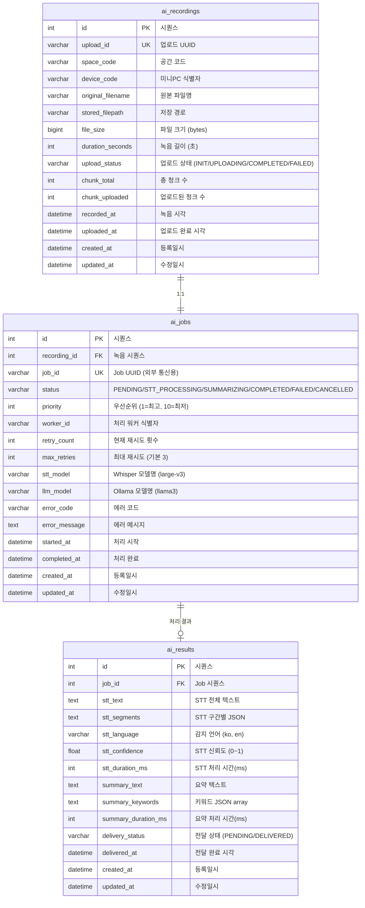

# AI System Architecture - ku_ai_worker

> 강의 녹음 음성 파일(.wav)을 STT(Whisper) + 요약(Ollama)하는 중앙 AI 처리 시스템 설계 문서

---

## 1. 시스템 개요

### 배경
- 각 강의실(22개)에 미니PC가 설치되어 있으나 AI 처리를 위한 스펙 부족
- 중앙에 고사양 GPU 서버를 두고 AI 처리를 집중 수행
- 3시간 녹음 파일 기준 1GB ~ 2GB 대용량 파일 처리 필요

### 목표
1. 미니PC에서 녹음한 .wav 파일을 중앙 서버(ku_ai_worker)에 업로드
2. Whisper로 음성 → 텍스트 변환 (STT)
3. Ollama로 텍스트 → 요약 처리
4. 처리 완료 시 미니PC가 결과를 가져감 (Polling)

---

## 2. 소스 관리 전략

### 결정: 모노레포 유지 + AI Worker 별도 레포

```
GitHub
├── ku_wave_plat/          ← 기존 모노레포 유지
│   ├── apps/api           ← AI 모니터링 모듈 추가 (콘솔용 조회 API)
│   ├── apps/console       ← AI 강의요약 관리 화면
│   ├── apps/nfc
│   └── packages/
│
└── ku_ai_worker/          ← 별도 레포 (Python)
    ├── worker/
    │   ├── stt.py         ← Whisper 처리
    │   ├── summarizer.py  ← Ollama 요약
    │   └── consumer.py    ← Job Queue Consumer
    ├── api/
    │   └── routes.py      ← 업로드/상태조회/결과 API
    ├── Dockerfile
    ├── requirements.txt
    └── docker-compose.yml
```

### 분리 근거

| 관점 | ku_wave_plat (모노레포) | ku_ai_worker (별도 레포) |
|------|------------------------|------------------------|
| 언어 | TypeScript / Node.js | Python |
| 빌드 | pnpm + Turborepo | pip / conda |
| 배포 환경 | 일반 서버 / 미니PC | GPU 서버 + Docker |
| 의존성 | NestJS, Next.js | Whisper, Ollama, PyTorch, CUDA |
| 개발자 | FE/BE 개발자 | AI/ML 엔지니어 |

Python 생태계와 TypeScript 생태계가 완전히 다르므로 같은 모노레포에 넣으면 빌드/배포/의존성 관리가 복잡해짐.

---

## 3. 전체 시스템 아키텍처

### 구성도

```
 [강의실 A]        [강의실 B]        ...  [강의실 N]
 미니PC            미니PC                 미니PC
 ┌─────────┐      ┌─────────┐           ┌─────────┐
 │ 녹음    │      │ 녹음    │           │ 녹음    │
 │ (.wav)  │      │ (.wav)  │           │ (.wav)  │
 │ 1~2 GB  │      │ 1~2 GB  │           │ 1~2 GB  │
 └────┬────┘      └────┬────┘           └────┬────┘
      └───────────────┼─────────────────────┘
                      │ 교내 네트워크 (유선 1Gbps 권장)
                      ▼
 ╔════════════════════════════════════════════════╗
 ║  ku_ai_worker (중앙 GPU 서버)                  ║
 ║                                                ║
 ║  ┌──────────┐  ┌──────────┐  ┌──────────────┐ ║
 ║  │ REST API │  │ Job Queue│  │ AI Engine    │ ║
 ║  │ (업로드, │  │ (FIFO,   │  │ - Whisper    │ ║
 ║  │  상태,   │→ │  우선순위│→ │ - Ollama     │ ║
 ║  │  결과)   │  │  기반)   │  │              │ ║
 ║  └──────────┘  └──────────┘  └──────────────┘ ║
 ║                                                ║
 ║  ┌──────────┐  ┌──────────────────────────┐   ║
 ║  │ SQLite   │  │ File Storage             │   ║
 ║  │ (Job DB) │  │ /data/ai-recordings/     │   ║
 ║  └──────────┘  └──────────────────────────┘   ║
 ╚════════════════════════════════════════════════╝
                      │
              상태/결과 동기화 (선택)
                      │
 ╔════════════════════╧═══════════════════════════╗
 ║  ku_wave_plat API 서버 (NestJS)                ║
 ║  - AI 작업 모니터링 화면 (콘솔)                 ║
 ║  - 전체 이력 조회/관리                          ║
 ╚════════════════════════════════════════════════╝
```

### 통신 방향

```
① 업로드:  미니PC ──(.wav 파일)──→ ku_ai_worker
② 결과:    미니PC ←─(JSON 응답)── ku_ai_worker
③ 동기화:  ku_ai_worker ──(상태/결과)──→ API서버 (선택, 콘솔 모니터링용)
```

---

## 4. 상세 프로세스 흐름

### 전체 흐름 (12단계)

```
미니PC (1호실)                        ku_ai_worker
──────────────                        ──────────────

① 강의시작, 마이크로 녹음 중...
② 녹음 종료 → .wav 파일 생성 (1.5GB)

③ ku_ai_worker에 청크 업로드 (100MB 단위)
   POST /api/upload/init ────────────→ upload_id 발급
   PUT  /api/upload/{id}/chunk/1 ───→ 100MB 저장
   PUT  /api/upload/{id}/chunk/2 ───→ 100MB 저장
   ... (15회 반복) ...
   POST /api/upload/{id}/complete ──→ 청크 병합
                                      ④ Job Queue에 즉시 등록
                                         status: PENDING

                                      ⑤ Worker가 Queue에서 꺼냄
                                         Whisper STT 시작
                                         status: STT_PROCESSING

                                      ⑥ STT 완료 → 텍스트 저장

                                      ⑦ Ollama 요약 시작
                                         status: SUMMARIZING

                                      ⑧ 요약 완료
                                         status: COMPLETED

⑨ "끝났어?" Polling (5분 간격) ─────→ "아직" (PROCESSING 응답)
⑨ "끝났어?" Polling (5분 간격) ─────→ "아직" (PROCESSING 응답)
⑨ "끝났어?" Polling (5분 간격) ─────→ ✅ "완료!" (COMPLETED 응답)
⑩ ←──────────────── 결과 JSON 응답
   (STT 전문 + 요약문 + 키워드 + 메타정보)

⑪ 미니PC가 자기 DB에 결과 저장
   → 콘솔 화면에서 조회/다운로드 가능

                                      ⑫ 다음 Job 처리 반복...
                                         + 매일 새벽 오래된 .wav 정리
```

### Job 상태 전이도

```
PENDING → STT_PROCESSING → SUMMARIZING → COMPLETED
   │            │                │
   │            ▼                ▼
   │         FAILED ←────── FAILED
   │            │
   │      (retry < max_retries?)
   │         YES → PENDING (재시도)
   │         NO  → FAILED (최종 실패)
   │
   ▼
CANCELLED (수동 취소)
```

### 핵심 설계 결정

| 항목 | 결정 | 이유 |
|------|------|------|
| 스케줄러 vs 큐 | **Job Queue (이벤트 기반)** | 파일 업로드 즉시 처리 시작, 시간 기반 스케줄러 불필요 |
| 파일 전송 | **청크 업로드 (100MB 단위)** | 1~2GB 한번에 전송 시 네트워크 끊김 위험, 재전송 비용 |
| 결과 전달 | **미니PC가 Polling (5분)** | Push 방식은 미니PC 방화벽/NAT 이슈, Polling이 단순하고 안정적 |
| 파일 저장 | **파일시스템 직접 저장** | DB에 BLOB 저장 부적합, 경로만 DB에 기록 |
| API 서버 경유 | **직접 통신** | 1.5GB 파일이 API 서버 경유하면 불필요한 병목 |

---

## 5. 대용량 파일 업로드 전략

### 청크 업로드 프로토콜

```
미니PC                                 ku_ai_worker
──────                                 ──────────

1) 업로드 시작 요청
   POST /api/upload/init
   Body: {
     space_code: "SPC-101",
     device_code: "PC-101",
     filename: "lecture_20260218.wav",
     file_size: 1610612736,          // 1.5GB
     chunk_size: 104857600,          // 100MB
     duration_seconds: 10800,        // 3시간
     recorded_at: "2026-02-18T09:00:00"
   }
   Response: {
     upload_id: "550e8400-e29b-41d4-a716-446655440000",
     chunk_total: 16
   }

2) 청크 전송 (반복)
   PUT /api/upload/{upload_id}/chunk/{chunk_number}
   Content-Type: application/octet-stream
   Body: <binary chunk data>
   Response: { chunk_number: 1, status: "received" }

3) 업로드 완료
   POST /api/upload/{upload_id}/complete
   Response: {
     job_id: "job-uuid-here",
     status: "PENDING",
     message: "Job registered"
   }
```

### 파일 저장 구조

```
/data/ai-recordings/
├── uploads/              ← 청크 임시 저장
│   └── {upload_id}/
│       ├── chunk_001
│       ├── chunk_002
│       └── ...
├── completed/            ← 병합 완료 원본 파일
│   └── 2026/02/18/
│       └── {job_id}_{filename}.wav
├── results/              ← 처리 결과 텍스트
│   └── 2026/02/18/
│       ├── {job_id}_stt.json
│       └── {job_id}_summary.json
└── archive/              ← 보관 (정리 전 이동)
```

### 파일 정리 정책

```
- 처리 완료(COMPLETED) 후 7일 보관 → 자동 삭제
- 실패(FAILED) 후 3일 보관 → 자동 삭제
- 매일 새벽 3시 크론잡으로 정리
- 하루 최대 용량: 1.5GB × 22실 = 약 33GB
- 7일 보관 시 최대: 약 231GB 디스크 필요
```

---

## 6. ku_ai_worker API 엔드포인트

### 미니PC → ku_ai_worker

| Method | Endpoint | 설명 |
|--------|----------|------|
| POST | `/api/upload/init` | 업로드 시작, upload_id 발급 |
| PUT | `/api/upload/{upload_id}/chunk/{number}` | 청크 업로드 |
| POST | `/api/upload/{upload_id}/complete` | 업로드 완료, Job 등록 |
| GET | `/api/jobs/{job_id}/status` | 처리 상태 조회 (Polling) |
| GET | `/api/jobs/{job_id}/result` | 처리 결과 조회 (완료 시) |

### 상태 조회 응답 예시

```json
// 처리 중
{
  "job_id": "job-uuid",
  "status": "STT_PROCESSING",
  "progress": 65,
  "message": "Whisper 텍스트 추출 중..."
}

// 완료
{
  "job_id": "job-uuid",
  "status": "COMPLETED",
  "completed_at": "2026-02-18T11:30:00",
  "result_url": "/api/jobs/job-uuid/result"
}

// 실패
{
  "job_id": "job-uuid",
  "status": "FAILED",
  "error_code": "STT_TIMEOUT",
  "error_message": "Whisper 처리 시간 초과",
  "retry_count": 3
}
```

### 결과 조회 응답 예시

```json
{
  "job_id": "job-uuid",
  "recording": {
    "filename": "lecture_20260218.wav",
    "duration_seconds": 10800,
    "recorded_at": "2026-02-18T09:00:00"
  },
  "stt": {
    "full_text": "오늘 강의에서는 데이터구조의...",
    "language": "ko",
    "confidence": 0.92,
    "segments": [
      { "start": 0.0, "end": 5.2, "text": "오늘 강의에서는" },
      { "start": 5.2, "end": 10.1, "text": "데이터구조의..." }
    ],
    "processing_time_ms": 180000
  },
  "summary": {
    "text": "본 강의는 데이터구조의 기본 개념을 다루며...",
    "keywords": ["데이터구조", "연결리스트", "트리", "정렬"],
    "processing_time_ms": 30000
  }
}
```

---

## 7. DB 스키마 (ku_ai_worker 내부)

ku_ai_worker는 자체적으로 SQLite(또는 PostgreSQL)를 사용하여 Job 상태를 관리합니다.

### ERD



### DDL (SQLite 기준)

```sql
-- 녹음 파일 메타데이터
CREATE TABLE ai_recordings (
    id                INTEGER PRIMARY KEY AUTOINCREMENT,
    upload_id         TEXT    NOT NULL UNIQUE,
    space_code        TEXT    NOT NULL,
    device_code       TEXT    NOT NULL,
    original_filename TEXT    NOT NULL,
    stored_filepath   TEXT,
    file_size         INTEGER DEFAULT 0 NOT NULL,
    duration_seconds  INTEGER,
    upload_status     TEXT    DEFAULT 'INIT' NOT NULL,
    chunk_total       INTEGER DEFAULT 0,
    chunk_uploaded    INTEGER DEFAULT 0,
    recorded_at       TEXT,
    uploaded_at       TEXT,
    created_at        TEXT    DEFAULT (datetime('now')) NOT NULL,
    updated_at        TEXT    DEFAULT (datetime('now')) NOT NULL
);

CREATE INDEX idx_rec_device ON ai_recordings (device_code);
CREATE INDEX idx_rec_status ON ai_recordings (upload_status);
CREATE INDEX idx_rec_date   ON ai_recordings (recorded_at);


-- AI 처리 작업 큐
CREATE TABLE ai_jobs (
    id                INTEGER PRIMARY KEY AUTOINCREMENT,
    recording_id      INTEGER NOT NULL REFERENCES ai_recordings(id) ON DELETE CASCADE,
    job_id            TEXT    NOT NULL UNIQUE,
    status            TEXT    DEFAULT 'PENDING' NOT NULL,
    priority          INTEGER DEFAULT 5 NOT NULL,
    worker_id         TEXT,
    retry_count       INTEGER DEFAULT 0 NOT NULL,
    max_retries       INTEGER DEFAULT 3 NOT NULL,
    stt_model         TEXT    DEFAULT 'large-v3',
    llm_model         TEXT    DEFAULT 'llama3',
    error_code        TEXT,
    error_message     TEXT,
    started_at        TEXT,
    completed_at      TEXT,
    created_at        TEXT    DEFAULT (datetime('now')) NOT NULL,
    updated_at        TEXT    DEFAULT (datetime('now')) NOT NULL
);

CREATE INDEX idx_job_recording ON ai_jobs (recording_id);
CREATE INDEX idx_job_status    ON ai_jobs (status);
CREATE INDEX idx_job_pending   ON ai_jobs (status, priority, created_at);


-- AI 처리 결과
CREATE TABLE ai_results (
    id                 INTEGER PRIMARY KEY AUTOINCREMENT,
    job_id             INTEGER NOT NULL UNIQUE REFERENCES ai_jobs(id) ON DELETE CASCADE,
    stt_text           TEXT,
    stt_segments       TEXT,
    stt_language       TEXT,
    stt_confidence     REAL,
    stt_duration_ms    INTEGER,
    summary_text       TEXT,
    summary_keywords   TEXT,
    summary_duration_ms INTEGER,
    delivery_status    TEXT    DEFAULT 'PENDING' NOT NULL,
    delivered_at       TEXT,
    created_at         TEXT    DEFAULT (datetime('now')) NOT NULL,
    updated_at         TEXT    DEFAULT (datetime('now')) NOT NULL
);

CREATE INDEX idx_result_delivery ON ai_results (delivery_status);
```

---

## 8. ku_wave_plat 측 연동 (모노레포)

미니PC가 ku_ai_worker에서 받은 결과를 자기 DB(MariaDB)에 저장하는 구조.

### 관련 테이블 (기존 DB에 추가)

> 주의: CRITICAL RULES에 따라 실제 테이블 생성은 별도 승인 필요

```sql
-- 강의 요약 결과 저장 (미니PC가 ku_ai_worker에서 받은 결과 저장용)
-- 메뉴: AI시스템 > 강의요약 (/ai-system/lecture-summary)

CREATE TABLE tb_ai_lecture_summary (
    summary_seq         INT AUTO_INCREMENT COMMENT '시퀀스' PRIMARY KEY,
    space_seq           INT                                  NOT NULL COMMENT '공간 시퀀스',
    tu_seq              INT                                  NULL     COMMENT '강의자 시퀀스',
    device_code         VARCHAR(50)                          NOT NULL COMMENT '미니PC 식별자',
    job_id              VARCHAR(36)                          NOT NULL COMMENT 'ku_ai_worker Job UUID',

    -- 녹음 정보
    recording_title     VARCHAR(200)                         NULL     COMMENT '강의 제목',
    recording_filename  VARCHAR(255)                         NOT NULL COMMENT '원본 파일명',
    duration_seconds    INT                                  NULL     COMMENT '녹음 길이 (초)',
    recorded_at         DATETIME                             NULL     COMMENT '녹음 시각',

    -- STT 결과
    stt_text            LONGTEXT                             NULL     COMMENT 'STT 전체 텍스트',
    stt_language        VARCHAR(10)                          NULL     COMMENT '감지 언어',
    stt_confidence      FLOAT                                NULL     COMMENT 'STT 신뢰도',

    -- 요약 결과
    summary_text        LONGTEXT                             NULL     COMMENT '요약 텍스트',
    summary_keywords    TEXT                                 NULL     COMMENT '키워드 JSON',

    -- 상태
    process_status      ENUM('UPLOADING','PROCESSING','COMPLETED','FAILED')
                                     DEFAULT 'UPLOADING'    NOT NULL COMMENT '처리 상태',
    completed_at        DATETIME                             NULL     COMMENT '처리 완료 시각',
    summary_isdel       CHAR         DEFAULT 'N'             NOT NULL COMMENT '삭제 여부',
    reg_date            DATETIME     DEFAULT CURRENT_TIMESTAMP() NOT NULL COMMENT '등록일시',
    upd_date            DATETIME     DEFAULT CURRENT_TIMESTAMP() NOT NULL
                                     ON UPDATE CURRENT_TIMESTAMP() COMMENT '수정일시',

    CONSTRAINT uk_job_id UNIQUE (job_id),
    CONSTRAINT fk_summary_space
        FOREIGN KEY (space_seq) REFERENCES tb_space (space_seq) ON DELETE CASCADE,
    CONSTRAINT fk_summary_user
        FOREIGN KEY (tu_seq) REFERENCES tb_users (tu_seq) ON DELETE SET NULL
) COMMENT '강의 요약 결과' CHARSET = utf8mb4;

CREATE INDEX idx_summary_space    ON tb_ai_lecture_summary (space_seq);
CREATE INDEX idx_summary_user     ON tb_ai_lecture_summary (tu_seq);
CREATE INDEX idx_summary_device   ON tb_ai_lecture_summary (device_code);
CREATE INDEX idx_summary_status   ON tb_ai_lecture_summary (process_status);
CREATE INDEX idx_summary_date     ON tb_ai_lecture_summary (recorded_at);
CREATE INDEX idx_summary_isdel    ON tb_ai_lecture_summary (summary_isdel);
```

---

## 9. 인프라 요구사항

### 중앙 GPU 서버 권장 사양

| 항목 | 최소 사양 | 권장 사양 |
|------|----------|----------|
| CPU | 8코어 | 16코어 |
| RAM | 32GB | 64GB |
| GPU | RTX 3060 (12GB VRAM) | RTX 4070 이상 (12GB+) |
| Storage | 500GB SSD | 1TB NVMe SSD |
| Network | 1Gbps | 1Gbps |

### 디스크 용량 산정

```
일일 최대: 1.5GB × 22실 = 33GB
7일 보관: 33GB × 7 = 231GB
결과 텍스트: 무시 가능 (수 MB)
AI 모델: Whisper large-v3 (~3GB) + Ollama 모델 (~7GB) = ~10GB
OS + 소프트웨어: ~50GB
─────────────────────────
총 필요: 약 300GB (여유 포함 500GB 권장)
```

### 네트워크 요구사항

```
1.5GB 파일 전송 시간:
- 100Mbps: 약 2분
- 1Gbps: 약 12초

22개 호실 동시 업로드 (최악의 경우):
- 1Gbps ÷ 22 = 약 45Mbps/실 → 파일당 약 4.5분
- 교내 유선 네트워크 1Gbps면 충분
```

---

## 10. 보안 고려사항

| 항목 | 방안 |
|------|------|
| API 인증 | 미니PC별 API Key 발급 (tb_nfc_reader의 reader_api_key와 유사) |
| 파일 전송 | HTTPS (교내 네트워크라도 암호화 권장) |
| 접근 제어 | ku_ai_worker는 교내 네트워크에서만 접근 가능 (방화벽) |
| 파일 검증 | 업로드 시 파일 형식/크기 검증, 청크 해시 검증 |

---

## 11. 향후 확장 고려

| 항목 | 현재 | 향후 |
|------|------|------|
| Worker 수 | 1대 (단일 GPU 서버) | N대 (GPU 클러스터) |
| 지원 언어 | 한국어 | 다국어 (Whisper 자체 지원) |
| 요약 모델 | Ollama (로컬) | GPT API (클라우드) 선택 가능 |
| 실시간 처리 | 녹음 완료 후 처리 | 실시간 스트리밍 STT |
| Job Queue | SQLite (단일 서버) | Redis/RabbitMQ (분산) |
| 결과 전달 | Polling (5분) | WebSocket Push |

---

## 관련 문서

| 문서 | 설명 |
|------|------|
| `docs/ai-realtime-speech-design.md` | 실시간 음성인식 + 음성 명령 + 강의요약 통합 설계서 |
| `docs/ai-ddl.sql` | AI 시스템 DB DDL (바로 실행 가능) |

---

## 변경 이력

| 일자 | 내용 | 작성자 |
|------|------|--------|
| 2026-02-18 | 초안 작성 - 전체 시스템 아키텍처 설계 | DB Architect |
| 2026-02-19 | 실시간 음성인식 설계 추가 (별도 문서), 관련문서 링크 | DB Architect |
