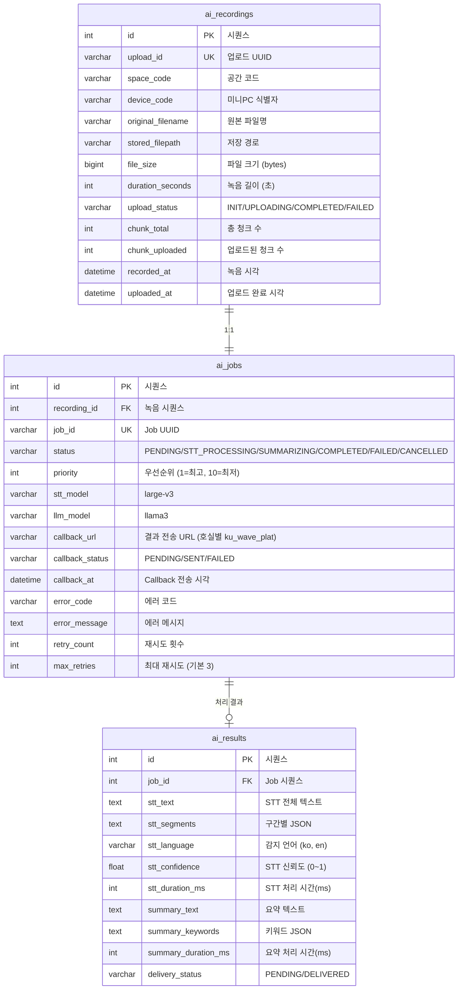

# AI System Architecture

> 강의실 녹음 → 실시간 음성인식(Voice Detect) → AI 처리(STT + 요약) 통합 시스템 설계 문서

---

## 1. 시스템 개요

### 배경
- 22개 강의실에 각각 ku_wave_plat(관리서버) + miniPC(녹음단말) 한 쌍 설치
- 중앙 GPU 서버(ku_ai_worker) 1대로 고품질 AI 처리 집중 수행
- 실시간 음성명령(Voice Detect)은 miniPC 로컬 CPU에서 처리
- 정밀 STT + 요약은 중앙 GPU 서버에서 배치 처리

### 목표
1. miniPC에서 마이크 녹음(.wav) + 실시간 STT(CPU) + 음성명령 감지
2. 음성명령 감지 시 ku_wave_plat API 호출 → 장비 제어 (Voice Detect)
3. 강의종료 후 .wav 파일을 ku_ai_worker에 직접 청크 업로드
4. ku_ai_worker에서 Whisper STT + Ollama 요약 배치 처리
5. 처리 완료 시 ku_ai_worker가 해당 호실의 ku_wave_plat에 Callback

### 서버 구성

| 서버 | 수량 | 역할 | 특징 |
|------|------|------|------|
| **ku_wave_plat** | 22대 (호실별) | NestJS API + Next.js Console + 로컬 MariaDB | 관리/제어/저장 |
| **miniPC** | 22대 (호실별) | Python 녹음 + 실시간 STT + Voice Detect | 녹음/인식/감지 |
| **ku_ai_worker** | 1대 (공유) | GPU 기반 Whisper STT + Ollama 요약 | 정밀 AI 처리 |

### 호실별 구성

```
┌─ N호실 ──────────────────────────────────┐
│                                          │
│  ku_wave_plat (10.0.1.1NN)              │
│  ├─ NestJS API (:8000)                  │
│  ├─ Next.js Console (:3000)             │
│  └─ MariaDB (:3306) ← 로컬 독립 DB      │
│           ↕ localhost                    │
│  miniPC (10.0.1.N)                      │
│  ├─ 마이크 녹음 (.wav)                   │
│  ├─ faster-whisper small (CPU 실시간STT) │
│  └─ Voice Detect (음성명령 감지)          │
│                                          │
└──────────────────────────────────────────┘
  × 22개 호실 (동일 코드 배포)
```

---

## 2. 소스 관리 전략

### 결정: 3개 레포 (모노레포 + AI Worker + miniPC)

```
GitHub
├── ku_wave_plat/          ← 모노레포 (TypeScript)
│   ├── apps/api           ← AI Callback 수신, 장비제어, 로그저장 API
│   ├── apps/console       ← AI 강의요약/음성인식 관리 화면
│   └── packages/          ← 공유 타입, UI 컴포넌트
│
├── ku_ai_worker/          ← 별도 레포 (Python)
│   ├── worker/            ← Whisper STT + Ollama 요약
│   ├── api/               ← 업로드 수신, Job 관리, Callback 발송
│   └── docker-compose.yml
│
└── ku_mini_pc/            ← 별도 레포 (Python)
    ├── recorder/          ← 마이크 녹음 (pyaudio + wave)
    ├── stt/               ← faster-whisper small (실시간 STT)
    ├── voice_detect/      ← 음성명령 감지 + ku_wave_plat API 호출
    └── uploader/          ← 청크 업로드 (→ ku_ai_worker 직접)
```

### 분리 근거

| 관점 | ku_wave_plat | ku_mini_pc | ku_ai_worker |
|------|-------------|-----------|-------------|
| 언어 | TypeScript | Python | Python |
| 역할 | 관리/제어/저장 | 녹음/실시간STT/Voice Detect | 정밀STT/요약 |
| 배포 | 22대 동일코드 | 22대 동일코드 | 1대 |
| 하드웨어 | 일반 서버 | 일반 PC + 마이크 | GPU 서버 |
| DB | MariaDB (로컬) | 없음 (Stateless) | SQLite |
| 의존성 | NestJS, Next.js | faster-whisper, pyaudio | Whisper, Ollama, CUDA |

---

## 3. 전체 시스템 아키텍처

### 구성도

```
╔══════════════════════════════════════════════════════════════════════╗
║                        교내 네트워크 (고정 IP)                        ║
║                                                                      ║
║  ┌─ 1호실 ────────────────────┐  ┌─ 2호실 ────────────────────┐     ║
║  │  ku_wave_plat  10.0.1.101  │  │  ku_wave_plat  10.0.1.102  │     ║
║  │  (NestJS+Console+MariaDB)  │  │  (NestJS+Console+MariaDB)  │     ║
║  │           ↕ localhost      │  │           ↕ localhost      │     ║
║  │  miniPC        10.0.1.1    │  │  miniPC        10.0.1.2    │     ║
║  │  (Python 녹음+STT+Detect)  │  │  (Python 녹음+STT+Detect)  │     ║
║  └────────────────────────────┘  └────────────────────────────┘     ║
║                                                                      ║
║                        ... × 22개 호실 ...                            ║
║                                                                      ║
║  ┌─ 22호실 ───────────────────┐                                      ║
║  │  ku_wave_plat  10.0.1.122  │                                      ║
║  │           ↕ localhost      │                                      ║
║  │  miniPC        10.0.1.22   │                                      ║
║  └────────────────────────────┘                                      ║
║                 │                                                     ║
║                 └──────────────┬─────────────────────                 ║
║                                │                                      ║
║              ┌─────────────────┴──────────────────┐                   ║
║              │      ku_ai_worker (GPU 서버)         │                   ║
║              │      10.0.0.200                     │                   ║
║              │      Whisper large-v3 + Ollama       │                   ║
║              │      전체 공유 1대                    │                   ║
║              └────────────────────────────────────┘                   ║
╚══════════════════════════════════════════════════════════════════════╝
```

### 통신 방향 (4경로)

```
┌──────────┐           ┌──────────────┐           ┌──────────────┐
│  miniPC  │           │ ku_wave_plat │           │ ku_ai_worker │
│  (녹음)   │           │   (로컬 서버) │           │   (GPU)      │
└────┬─────┘           └──────┬───────┘           └──────┬───────┘
     │                        │                          │
     │ ─① Voice Detect ─────▶│                          │
     │   POST /commands/exec  │  장비 제어 실행           │
     │ ◀── 실행결과 응답 ──── │  + command_log 저장       │
     │                        │                          │
     │ ─② 로그/세션 저장 ────▶│                          │
     │   speech_log            │  DB 저장                 │
     │   session 생성/종료      │                          │
     │   lecture_summary 생성   │                          │
     │                        │                          │
     │ ─③ Chunk Upload ──────┼─────────────────────────▶│
     │   .wav 직접 전송        │  (ku_wave_plat 미경유)    │
     │   + callback_url =     │                          │
     │     ku_wave_plat IP    │                          │
     │                        │                          │
     │                        │ ◀── ④ Callback ──────── │
     │                        │   STT + 요약 결과 전송     │
     │                        │   → tb_ai_lecture_summary │

① miniPC → ku_wave_plat : Voice Detect (음성명령 감지 → 장비 제어 요청)
② miniPC → ku_wave_plat : 로그/세션 저장 (speech_log, session, lecture_summary)
③ miniPC → ku_ai_worker : .wav 파일 청크 업로드 (직접, ku_wave_plat 미경유)
④ ku_ai_worker → ku_wave_plat : AI 처리 결과 Callback (해당 호실 서버로)
```

---

## 4. 상세 프로세스 흐름

### 전체 흐름 - 하이브리드 방식 (로컬 CPU + 중앙 GPU)

```
miniPC                      ku_wave_plat (로컬)           ku_ai_worker (GPU)
  │                                │                              │
  │ [1] 교사 "강의시작" 클릭        │                              │
  │  🎤 녹음 시작 (.wav)            │                              │
  │  🗣️ faster-whisper small 시작   │                              │
  │                                │                              │
  │  GET /voice-commands ─────────▶│ 명령어 사전 응답              │
  │  ◀── 명령어 목록 캐싱 ──────── │                              │
  │                                │                              │
  │  POST /speech-sessions ───────▶│ 세션 생성 (ACTIVE)           │
  │                                │ → tb_ai_speech_session       │
  │                                │                              │
  │ [2] 강의 중 - 실시간 STT        │                              │
  │  "오늘 수업은 3장입니다"        │                              │
  │  → 일반 텍스트 → 자막 표시     │                              │
  │  POST /speech-logs ───────────▶│ STT 로그 저장                │
  │                                │ → tb_ai_speech_log           │
  │                                │                              │
  │ [3] Voice Detect (음성명령)     │                              │
  │  ⚡ "스크린 올려" 감지           │                              │
  │  POST /commands/execute ──────▶│ 장비 제어 실행                │
  │                                │ + command_log 자동 저장       │
  │  ◀── 실행결과 응답 ────────── │ → tb_ai_command_log          │
  │  화면에 "스크린 올림" 표시      │                              │
  │                                │                              │
  │  ⚡ "조명 밝게" 감지             │                              │
  │  POST /commands/execute ──────▶│ 장비 제어 + 로그 저장         │
  │  ◀── 실행결과 응답 ────────── │                              │
  │                                │                              │
  │ [4] 교사 "강의종료" 클릭        │                              │
  │  녹음 중지 → .wav 완성         │                              │
  │  PUT /speech-sessions/end ────▶│ 세션 종료 (ENDED)            │
  │  POST /lecture-summaries ─────▶│ 요약 레코드 생성 (UPLOADING)  │
  │                                │ → tb_ai_lecture_summary       │
  │                                │                              │
  │ [5] .wav Chunk Upload (직접)   │                              │
  │  POST /api/upload/init ────────┼─────────────────────────────▶│
  │    + callback_url:             │                              │
  │      http://10.0.1.101:8000    │                              │
  │      /api/v1/ai-system         │                              │
  │      /ai/callback              │                              │
  │  PUT  /api/upload/chunk × N ───┼─────────────────────────────▶│
  │  POST /api/upload/complete ────┼─────────────────────────────▶│
  │                                │                              │
  │  PUT /lecture-summaries/status─▶│ 상태 → PROCESSING           │
  │                                │                              │
  │                                │                        [6] Job Queue 등록
  │                                │                            status: PENDING
  │                                │                              │
  │                                │                        [7] Whisper large-v3
  │                                │                            (정밀 STT, 95%+)
  │                                │                              │
  │                                │                        [8] Ollama llama3
  │                                │                            (강의 요약)
  │                                │                              │
  │                                │  [9] Callback                │
  │                                │  POST /ai-system/ai/callback │
  │                                │◀─────────────────────────────┤
  │                                │  { job_id, stt_text,         │
  │                                │    summary_text, keywords }  │
  │                                │                              │
  │                                │ [10] 결과 저장               │
  │                                │  tb_ai_lecture_summary       │
  │                                │  (status → COMPLETED)        │
  │                                │                              │
  │                                │ [Console]                    │
  │                                │  교사 브라우저에서            │
  │                                │  강의요약 결과 확인 가능      │
  ▼                                ▼                              ▼
```

### Voice Detect 상세

```
miniPC 내부                                    ku_wave_plat API
┌──────────────────────────────┐              ┌─────────────────────────┐
│                              │              │                         │
│  🎤 마이크 입력                │              │  NestJS API             │
│       │                      │              │                         │
│       ▼                      │              │                         │
│  faster-whisper small (CPU)  │              │                         │
│       │                      │              │                         │
│       ▼                      │              │                         │
│  ┌────────────────────┐      │              │                         │
│  │ Voice Detect 엔진   │      │              │                         │
│  │                    │      │              │                         │
│  │ STT 텍스트 수신     │      │              │                         │
│  │       │            │      │              │                         │
│  │       ▼            │      │              │                         │
│  │ 명령어 사전 매칭    │      │              │                         │
│  │ (시작 시 캐싱)      │      │              │                         │
│  │       │            │      │              │                         │
│  │  ┌────┴────┐       │      │              │                         │
│  │  │         │       │      │              │                         │
│  │ 매칭X    매칭O     │      │   HTTP       │                         │
│  │  │         │       │      │  (localhost) │                         │
│  │  ▼         ▼       │      │              │                         │
│  │ 자막     API 호출 ─┼──────┼─────────────▶│  POST /commands/execute  │
│  │ 표시       │       │      │              │       │                 │
│  │            │       │      │              │  ┌────▼──────────────┐  │
│  │            │       │      │              │  │ 1. 명령어 검증     │  │
│  │            │       │      │              │  │ 2. 장비 제어 실행  │  │
│  │            │       │      │              │  │ 3. command_log 저장│  │
│  │            │       │      │              │  └────┬──────────────┘  │
│  │            │       │      │              │       │                 │
│  │         ◀──┼───────┼──────┼──────────────┼───────┘                 │
│  │   실행결과  │       │      │   응답       │  { success: true,       │
│  │   화면표시  │       │      │              │    action: "스크린올림" }│
│  │            │       │      │              │                         │
│  └────────────┘       │      │              │                         │
└───────────────────────┘      │              └─────────────────────────┘

명령어 사전 (tb_ai_voice_command에서 캐싱):
┌──────────────────────────────────────────────────┐
│  "스크린 올려"    → device: 전동스크린, cmd: UP    │
│  "스크린 내려"    → device: 전동스크린, cmd: DOWN  │
│  "조명 밝게"      → device: 조명, cmd: BRIGHT      │
│  "조명 어둡게"    → device: 조명, cmd: DIM          │
│  "다음 페이지"    → device: PC, cmd: PAGE_NEXT     │
└──────────────────────────────────────────────────┘
```

### 듀얼 STT 전략

| 단계 | 위치 | STT 모델 | 목적 | 인식률 |
|------|------|----------|------|--------|
| **강의 중** (실시간) | miniPC CPU | faster-whisper small | 음성명령 감지 + 자막 | ~85% |
| **강의 후** (배치) | ku_ai_worker GPU | Whisper large-v3 | 정밀 STT + 요약 | ~95%+ |

### ku_ai_worker 시점 (22개 호실 동시)

```
┌─ ku_ai_worker (GPU 서버 1대) ────────────────────────────────────────┐
│                                                                       │
│  수신 큐 (22개 호실에서 업로드)                                        │
│                                                                       │
│  ┌──────────────────────────────────────────────────────────────┐     │
│  │ Job Queue (FIFO + 우선순위)                                   │     │
│  │                                                              │     │
│  │  [Job-1] 1호실  callback: http://10.0.1.101:8000/...        │     │
│  │  [Job-2] 5호실  callback: http://10.0.1.105:8000/...        │     │
│  │  [Job-3] 3호실  callback: http://10.0.1.103:8000/...        │     │
│  │  [Job-4] 12호실 callback: http://10.0.1.112:8000/...        │     │
│  │  ...                                                        │     │
│  └──────────────────────────────────────────────────────────────┘     │
│          │                                                            │
│          ▼  순차 처리                                                  │
│  ┌──────────────────────┐                                             │
│  │ Whisper large-v3     │ ──▶ 정밀 STT (95%+)                        │
│  └──────────┬───────────┘                                             │
│             ▼                                                         │
│  ┌──────────────────────┐                                             │
│  │ Ollama llama3        │ ──▶ 강의 요약                                │
│  └──────────┬───────────┘                                             │
│             ▼                                                         │
│  Callback → 각 호실의 ku_wave_plat으로 결과 전송                       │
│                                                                       │
│  POST http://10.0.1.101:8000/api/v1/ai-system/ai/callback ──▶ 1호실  │
│  POST http://10.0.1.105:8000/api/v1/ai-system/ai/callback ──▶ 5호실  │
│  POST http://10.0.1.103:8000/api/v1/ai-system/ai/callback ──▶ 3호실  │
│  ...                                                                  │
└───────────────────────────────────────────────────────────────────────┘
```

### Job 상태 전이도

```
PENDING → STT_PROCESSING → SUMMARIZING → COMPLETED
   │            │                │
   │            ▼                ▼
   │         FAILED ←────── FAILED
   │            │
   │      (retry < max_retries?)
   │         YES → PENDING (재시도)
   │         NO  → FAILED (최종 실패)
   │
   ▼
CANCELLED (수동 취소)
```

### 장애 시나리오별 동작

| 장애 상황 | miniPC 녹음 | 실시간 STT | 음성명령 | 업로드/로그 |
|-----------|------------|-----------|---------|------------|
| **네트워크 끊김** (miniPC ↔ 서버) | 계속 (로컬) | 계속 (로컬 CPU) | 계속 (로컬 처리) | 로컬 버퍼 → 복구 후 재전송 |
| **ku_ai_worker 장애** (GPU 서버 다운) | 계속 | 계속 | 계속 | ku_wave_plat 저장 완료, 배치 처리만 대기 |
| **ku_wave_plat 장애** (로컬 서버 다운) | 계속 | 계속 | **불가** (장비제어 불가) | 로컬 보관 → 복구 후 전송 |

> **핵심: 어떤 서버가 죽어도 강의 녹음과 실시간 STT는 중단되지 않음**

### 핵심 설계 결정

| 항목 | 결정 | 이유 |
|------|------|------|
| 실시간 STT | **miniPC 로컬 CPU (faster-whisper small)** | 반응속도 ~300ms, 네트워크 장애에도 동작, 22대 동시 가능 |
| 정밀 STT | **ku_ai_worker GPU (Whisper large-v3)** | 95%+ 인식률, GPU 집중 활용 |
| 파일 전송 | **miniPC → ku_ai_worker 직접 청크 업로드** | 1.5GB 파일 ku_wave_plat 경유 시 병목 |
| 결과 전달 | **Callback (ku_ai_worker → ku_wave_plat)** | 각 호실 서버가 결과 수신/저장, miniPC 서버 불필요 |
| Voice Detect | **miniPC 로컬 감지 → ku_wave_plat API 호출** | 반응속도 우선, ku_wave_plat이 장비 제어 수행 |
| DB | **각 호실 로컬 MariaDB (독립)** | 호실간 데이터 공유 불필요, 독립 운영 |
| 스케줄러 vs 큐 | **Job Queue (이벤트 기반)** | 업로드 즉시 처리, 시간 기반 스케줄러 불필요 |
| 파일 저장 | **파일시스템 직접 저장** | DB에 BLOB 저장 부적합, 경로만 DB 기록 |

---

## 5. 대용량 파일 업로드 전략

### 청크 업로드 프로토콜 (miniPC → ku_ai_worker 직접)

```
miniPC                                 ku_ai_worker
──────                                 ──────────

1) 업로드 시작 요청
   POST /api/upload/init
   Body: {
     space_code: "ROOM-101",
     device_code: "PC-101",
     filename: "lecture_20260223.wav",
     file_size: 1610612736,          // 1.5GB
     chunk_size: 104857600,          // 100MB
     duration_seconds: 10800,        // 3시간
     recorded_at: "2026-02-23T09:00:00",
     callback_url: "http://10.0.1.101:8000/api/v1/ai-system/ai/callback"
   }
   Response: {
     upload_id: "550e8400-e29b-41d4-a716-446655440000",
     chunk_total: 16
   }

2) 청크 전송 (반복)
   PUT /api/upload/{upload_id}/chunk/{chunk_number}
   Content-Type: application/octet-stream
   Body: <binary chunk data>
   Response: { chunk_number: 1, status: "received" }

3) 업로드 완료
   POST /api/upload/{upload_id}/complete
   Response: {
     job_id: "job-uuid-here",
     status: "PENDING",
     message: "Job registered"
   }
```

### 파일 저장 구조 (ku_ai_worker)

```
/data/ai-recordings/
├── uploads/              ← 청크 임시 저장
│   └── {upload_id}/
│       ├── chunk_001
│       ├── chunk_002
│       └── ...
├── completed/            ← 병합 완료 원본 파일
│   └── 2026/02/23/
│       └── {job_id}_{filename}.wav
├── results/              ← 처리 결과 텍스트
│   └── 2026/02/23/
│       ├── {job_id}_stt.json
│       └── {job_id}_summary.json
└── archive/              ← 보관 (정리 전 이동)
```

### 파일 정리 정책

```
- 처리 완료(COMPLETED) 후 7일 보관 → 자동 삭제
- 실패(FAILED) 후 3일 보관 → 자동 삭제
- 매일 새벽 3시 크론잡으로 정리
- 하루 최대 용량: 1.5GB × 22실 = 약 33GB
- 7일 보관 시 최대: 약 231GB 디스크 필요
```

---

## 6. ku_ai_worker API 엔드포인트

### miniPC → ku_ai_worker (청크 업로드)

| Method | Endpoint | 설명 |
|--------|----------|------|
| POST | `/api/upload/init` | 업로드 시작, upload_id 발급 (callback_url 포함) |
| PUT | `/api/upload/{upload_id}/chunk/{number}` | 청크 업로드 |
| POST | `/api/upload/{upload_id}/complete` | 업로드 완료, Job 등록 |
| GET | `/api/jobs/{job_id}/status` | 처리 상태 조회 (보조용) |
| GET | `/api/jobs/{job_id}/result` | 처리 결과 조회 (보조용) |

### ku_ai_worker → ku_wave_plat (Callback)

| Method | Endpoint | 설명 |
|--------|----------|------|
| POST | `{callback_url}` | AI 처리 완료 시 결과 전송 |

```
Callback URL 예시:
  http://10.0.1.101:8000/api/v1/ai-system/ai/callback  (1호실)
  http://10.0.1.105:8000/api/v1/ai-system/ai/callback  (5호실)
```

### Callback Payload

```json
{
  "job_id": "job-uuid",
  "upload_id": "upload-uuid",
  "status": "COMPLETED",
  "result": {
    "stt_text": "오늘 강의에서는 데이터구조의 기본 개념을...",
    "stt_language": "ko",
    "stt_confidence": 0.95,
    "stt_segments": [
      { "start": 0.0, "end": 5.2, "text": "오늘 강의에서는" }
    ],
    "stt_processing_time_ms": 180000,
    "summary_text": "본 강의는 데이터구조의 기본 개념을 다루며...",
    "summary_keywords": ["데이터구조", "연결리스트", "트리"],
    "summary_processing_time_ms": 30000
  }
}
```

### Callback 실패 시 재시도

```
실패 시 3회 재시도 (10초, 30초, 60초 간격)
모두 실패 시 callback_status = 'FAILED' → ku_ai_worker에 결과 보관
ku_wave_plat 복구 후 GET /api/jobs/{job_id}/result 로 수동 조회 가능
```

---

## 7. DB 스키마 (ku_ai_worker 내부 - SQLite)

ku_ai_worker는 자체 SQLite로 Job 상태를 관리합니다.

### ERD


```mermaid
erDiagram
    ai_recordings ||--|| ai_jobs : "1:1"
    ai_jobs ||--o| ai_results : "처리 결과"

    ai_recordings {
        int id PK "시퀀스"
        varchar upload_id UK "업로드 UUID"
        varchar space_code "공간 코드"
        varchar device_code "미니PC 식별자"
        varchar original_filename "원본 파일명"
        varchar stored_filepath "저장 경로"
        bigint file_size "파일 크기 (bytes)"
        int duration_seconds "녹음 길이 (초)"
        varchar upload_status "INIT/UPLOADING/COMPLETED/FAILED"
        int chunk_total "총 청크 수"
        int chunk_uploaded "업로드된 청크 수"
        datetime recorded_at "녹음 시각"
        datetime uploaded_at "업로드 완료 시각"
    }

    ai_jobs {
        int id PK "시퀀스"
        int recording_id FK "녹음 시퀀스"
        varchar job_id UK "Job UUID"
        varchar status "PENDING/STT_PROCESSING/SUMMARIZING/COMPLETED/FAILED/CANCELLED"
        int priority "우선순위 (1=최고, 10=최저)"
        varchar stt_model "large-v3"
        varchar llm_model "llama3"
        varchar callback_url "결과 전송 URL (호실별 ku_wave_plat)"
        varchar callback_status "PENDING/SENT/FAILED"
        datetime callback_at "Callback 전송 시각"
        varchar error_code "에러 코드"
        text error_message "에러 메시지"
        int retry_count "재시도 횟수"
        int max_retries "최대 재시도 (기본 3)"
    }

    ai_results {
        int id PK "시퀀스"
        int job_id FK "Job 시퀀스"
        text stt_text "STT 전체 텍스트"
        text stt_segments "구간별 JSON"
        varchar stt_language "감지 언어 (ko, en)"
        float stt_confidence "STT 신뢰도 (0~1)"
        int stt_duration_ms "STT 처리 시간(ms)"
        text summary_text "요약 텍스트"
        text summary_keywords "키워드 JSON"
        int summary_duration_ms "요약 처리 시간(ms)"
        varchar delivery_status "PENDING/DELIVERED"
    }
```

### DDL 스크립트

> 바로 실행 가능한 DDL: `docs/migrations/ku-ai-worker-sqlite.sql`

---

## 8. ku_wave_plat DB 스키마 (MariaDB - 호실별 로컬)

### 기존 테이블 (변경 없음)

| 테이블 | 용도 | 호출자 |
|--------|------|--------|
| `tb_ai_voice_command` | 음성 명령어 사전 | Console (등록), miniPC (조회/캐싱) |
| `tb_ai_speech_session` | 실시간 STT 세션 | miniPC (생성/종료) |
| `tb_ai_speech_log` | STT 텍스트 로그 | miniPC (저장) |
| `tb_ai_command_log` | 음성 명령 실행 로그 | ku_wave_plat (자동 저장) |
| `tb_ai_lecture_summary` | 강의 STT + 요약 결과 | miniPC (생성), Callback (결과 저장) |
| `tb_ai_worker_server` | AI Worker 서버 정보 | Console (등록/관리) |

> **DB 변경사항: 없음.** 기존 6개 테이블로 충분합니다.

### 데이터 흐름 → DB 매핑

```
[강의시작]
  miniPC POST /speech-sessions      → tb_ai_speech_session (ACTIVE)
  miniPC GET  /voice-commands        → tb_ai_voice_command (캐싱용 조회)

[강의 중]
  miniPC POST /speech-logs           → tb_ai_speech_log
  miniPC POST /commands/execute      → tb_ai_command_log (자동 저장)

[강의종료]
  miniPC PUT  /speech-sessions/end   → tb_ai_speech_session (ENDED)
  miniPC POST /lecture-summaries     → tb_ai_lecture_summary (UPLOADING)
  miniPC PUT  /lecture-summaries/status → tb_ai_lecture_summary (PROCESSING)

[AI 처리 완료]
  ku_ai_worker POST /ai/callback     → tb_ai_lecture_summary (COMPLETED + 결과)
```

---

## 9. 인프라 요구사항

### 호실별 ku_wave_plat 서버

| 항목 | 사양 |
|------|------|
| CPU | 4코어+ |
| RAM | 8GB+ |
| Storage | 100GB+ SSD |
| Network | 1Gbps (교내 유선) |
| OS | Linux / Windows |

### 호실별 miniPC

| 항목 | 사양 |
|------|------|
| CPU | 4코어+ (faster-whisper small 구동용) |
| RAM | 8GB+ (faster-whisper ~500MB 사용) |
| Storage | 50GB+ (임시 .wav 저장) |
| 마이크 | USB 마이크 또는 내장 마이크 |
| Network | 1Gbps (교내 유선) |

### 중앙 ku_ai_worker GPU 서버

| 항목 | 최소 사양 | 권장 사양 |
|------|----------|----------|
| CPU | 8코어 | 16코어 |
| RAM | 32GB | 64GB |
| GPU | RTX 3060 (12GB VRAM) | RTX 4070 이상 (12GB+) |
| Storage | 500GB SSD | 1TB NVMe SSD |
| Network | 1Gbps | 1Gbps |

### 디스크 용량 산정 (ku_ai_worker)

```
일일 최대: 1.5GB × 22실 = 33GB
7일 보관: 33GB × 7 = 231GB
AI 모델: Whisper large-v3 (~3GB) + Ollama (~7GB) = ~10GB
OS + 소프트웨어: ~50GB
─────────────────────────
총 필요: 약 300GB (여유 포함 500GB 권장)
```

### 네트워크 요구사항

```
1.5GB 파일 전송 시간:
- 100Mbps: 약 2분
- 1Gbps: 약 12초

22개 호실 동시 업로드 (최악의 경우):
- 1Gbps ÷ 22 = 약 45Mbps/실 → 파일당 약 4.5분
- 교내 유선 네트워크 1Gbps면 충분
```

---

## 10. 보안 고려사항

| 항목 | 방안 |
|------|------|
| API 인증 (miniPC → ku_wave_plat) | JWT Bearer 토큰 (기존 인증 체계) |
| API 인증 (miniPC → ku_ai_worker) | API Key (호실별 발급) |
| Callback 검증 (ku_ai_worker → ku_wave_plat) | callback_secret 서명 검증 (HMAC) |
| 파일 전송 | HTTPS (교내 네트워크라도 암호화 권장) |
| 접근 제어 | ku_ai_worker는 교내 네트워크에서만 접근 (방화벽) |
| 파일 검증 | 업로드 시 파일 형식/크기 검증, 청크 해시 검증 |

---

## 11. FE / BE 개발 가이드

### ku_wave_plat BE (NestJS API) 개발 항목

| # | 엔드포인트 | 설명 | 호출자 | 우선순위 |
|---|-----------|------|--------|---------|
| 1 | `POST /ai-system/ai/callback` | **AI 처리 결과 Callback 수신** | ku_ai_worker | 높음 |
| 2 | `POST /ai-system/commands/execute` | **Voice Detect 장비 제어 실행** | miniPC | 높음 |
| 3 | `GET /ai-system/voice-commands` | 음성 명령어 목록 조회 | Console, miniPC | 높음 |
| 4 | `POST /ai-system/voice-commands` | 음성 명령어 등록 | Console | 보통 |
| 5 | `PUT /ai-system/voice-commands/:seq` | 음성 명령어 수정 | Console | 보통 |
| 6 | `DELETE /ai-system/voice-commands/:seq` | 음성 명령어 삭제 | Console | 보통 |
| 7 | `POST /ai-system/lecture-summaries` | 강의요약 레코드 생성 | miniPC | 높음 |
| 8 | `PUT /ai-system/lecture-summaries/:seq/status` | 상태 변경 | miniPC | 높음 |
| 9 | `GET /ai-system/lecture-summaries` | 강의요약 목록 조회 | Console | 보통 |
| 10 | `GET /ai-system/lecture-summaries/:seq` | 강의요약 상세 조회 | Console | 보통 |
| 11 | `POST /ai-system/speech-sessions` | 세션 생성 (강의시작) | miniPC | 높음 |
| 12 | `PUT /ai-system/speech-sessions/:seq/end` | 세션 종료 (강의종료) | miniPC | 높음 |
| 13 | `POST /ai-system/speech-logs` | STT 로그 저장 | miniPC | 보통 |
| 14 | `GET /ai-system/speech-sessions` | 세션 목록 조회 | Console | 보통 |
| 15 | `GET /ai-system/speech-sessions/:seq` | 세션 상세 조회 | Console | 보통 |
| 16 | `GET /ai-system/worker-servers` | Worker 서버 목록 | Console | 낮음 |
| 17 | `POST /ai-system/worker-servers` | Worker 서버 등록 | Console | 낮음 |
| 18 | `PUT /ai-system/worker-servers/:seq` | Worker 서버 수정 | Console | 낮음 |
| 19 | `DELETE /ai-system/worker-servers/:seq` | Worker 서버 삭제 | Console | 낮음 |
| 20 | `GET /ai-system/worker-servers/:seq/health` | 헬스체크 (Proxy) | Console | 낮음 |

**BE 참조 문서:**
- API 스펙: `docs/api/ai-system.api.md`
- DB 스키마: `docs/init_database.sql` (AI 시스템 섹션)
- 공유 타입: `packages/types/src/ai.types.ts`

### ku_wave_plat FE (Next.js Console) 개발 항목

| # | 페이지 | 경로 | 설명 | 우선순위 |
|---|--------|------|------|---------|
| 1 | 강의요약 목록 | `/ai-system/lecture-summary` | 목록 조회 (필터/검색/페이징) | 높음 |
| 2 | 강의요약 상세 | `/ai-system/lecture-summary/[id]` | STT 전문 + 요약 + 키워드 | 높음 |
| 3 | 음성인식 세션 목록 | `/ai-system/speech` | 세션 목록 (필터/검색) | 보통 |
| 4 | 음성인식 세션 상세 | `/ai-system/speech/[id]` | STT 로그 + 명령 실행 로그 | 보통 |
| 5 | 음성 명령어 관리 | `/ai-system/voice-commands` | CRUD (공간/장비/명령 연결) | 보통 |
| 6 | AI Worker 서버 관리 | `/ai-system/worker-servers` | CRUD + 헬스체크 | 낮음 |

**FE 참조 문서:**
- API 스펙: `docs/api/ai-system.api.md`
- 공유 타입: `packages/types/src/ai.types.ts`
- 기존 LNB 메뉴: menu_seq 41 (강의요약), 42 (실시간 음성인식)

### ku_mini_pc (Python) 개발 항목

| # | 모듈 | 설명 | 통신 대상 | 우선순위 |
|---|------|------|----------|---------|
| 1 | `recorder/` | 마이크 녹음 (pyaudio + wave) | 로컬 | 높음 |
| 2 | `stt/` | faster-whisper small 실시간 STT | 로컬 CPU | 높음 |
| 3 | `voice_detect/` | 명령어 사전 매칭 + API 호출 | ku_wave_plat API | 높음 |
| 4 | `uploader/` | .wav 청크 업로드 | ku_ai_worker (직접) | 높음 |
| 5 | `api_client/` | ku_wave_plat API 클라이언트 (로그 저장) | ku_wave_plat API | 높음 |
| 6 | `ui/` | 교사용 UI (강의시작/종료, 자막표시) | 로컬 | 보통 |

**miniPC 참조 문서:**
- Voice Detect API: `docs/api/ai-system.api.md` (POST /commands/execute)
- 로그 저장 API: `docs/api/ai-system.api.md` (POST /speech-logs, /speech-sessions)
- 청크 업로드 프로토콜: 본 문서 Section 5
- 명령어 사전: `docs/api/ai-system.api.md` (GET /voice-commands)

### ku_ai_worker (Python) 개발 항목

| # | 모듈 | 설명 | 우선순위 |
|---|------|------|---------|
| 1 | `api/upload.py` | 청크 업로드 수신 + 파일 재조립 | 높음 |
| 2 | `worker/queue.py` | Job Queue 관리 (FIFO + 우선순위) | 높음 |
| 3 | `worker/stt.py` | Whisper large-v3 STT 처리 | 높음 |
| 4 | `worker/summarizer.py` | Ollama llama3 요약 처리 | 높음 |
| 5 | `worker/callback.py` | Callback 발송 (각 호실 ku_wave_plat으로) | 높음 |
| 6 | `api/health.py` | 헬스체크 API | 보통 |
| 7 | `cron/cleanup.py` | 파일 정리 크론잡 | 낮음 |

**ku_ai_worker 참조 문서:**
- 프로젝트 구조: `docs/ku-ai-worker-setup.md`
- SQLite DDL: `docs/migrations/ku-ai-worker-sqlite.sql`
- Callback Payload: 본 문서 Section 6

---

## 12. 향후 확장 고려

| 항목 | 현재 | 향후 |
|------|------|------|
| Worker 수 | 1대 (단일 GPU 서버) | N대 (GPU 클러스터) |
| 실시간 STT | miniPC 로컬 CPU (small) | GPU WebSocket 스트리밍 (medium+) |
| 지원 언어 | 한국어 | 다국어 (Whisper 자체 지원) |
| 요약 모델 | Ollama 로컬 | GPT API 클라우드 선택 가능 |
| Job Queue | SQLite (단일 서버) | Redis/RabbitMQ (분산) |
| 호실 간 데이터 | 독립 (로컬 DB) | 중앙 DB 통합 (관리자 대시보드) |
| miniPC UI | Python GUI | 브라우저 기반 (Console 확장) |

---

## 관련 문서

| 문서 | 설명 |
|------|------|
| `docs/api/ai-system.api.md` | ku_wave_plat AI 시스템 API 스펙 (20개 엔드포인트) |
| `docs/ku-ai-worker-setup.md` | ku_ai_worker 프로젝트 구조 + Docker + 설치 가이드 |
| `docs/migrations/ku-ai-worker-sqlite.sql` | ku_ai_worker SQLite DDL (바로 실행 가능) |
| `docs/migrations/ai-worker-server-mariadb.sql` | ku_wave_plat MariaDB tb_ai_worker_server DDL |
| `docs/init_database.sql` | 전체 DB DDL (AI 테이블 포함) |
| `packages/types/src/ai.types.ts` | 공유 TypeScript 타입 정의 |

---

## 변경 이력

| 일자 | 내용 | 작성자 |
|------|------|--------|
| 2026-02-18 | 초안 작성 - 전체 시스템 아키텍처 설계 | DB Architect |
| 2026-02-19 | 실시간 음성인식 설계 추가, 관련문서 링크 | DB Architect |
| 2026-02-23 | **전면 재설계** - 3서버 하이브리드 아키텍처 확정 | DB Architect |
|            | - 호실별 ku_wave_plat + miniPC 쌍 구성 (22세트) | |
|            | - 듀얼 STT: 실시간(miniPC CPU) + 배치(GPU) | |
|            | - Voice Detect: miniPC 감지 → ku_wave_plat 장비제어 | |
|            | - 직접 업로드: miniPC → ku_ai_worker (ku_wave_plat 미경유) | |
|            | - Callback: ku_ai_worker → 각 호실 ku_wave_plat | |
|            | - FE/BE/miniPC/Worker 개발 가이드 추가 | |
