# Player System ERD (Entity Relationship Diagram)

## 개요
Digital Signage Player 관리 시스템의 데이터베이스 관계도

---

## 전체 ERD (Mermaid)

```mermaid
erDiagram
    %% 기존 시스템 테이블
    tb_building ||--o{ tb_player : "설치"
    tb_building ||--o{ tb_player_group : "소속"
    tb_space ||--o{ tb_player : "상세위치"
    tb_users ||--o{ tb_player : "승인자"

    %% 플레이리스트 시스템
    tb_play_list ||--o{ tb_player : "현재재생"
    tb_play_list ||--o{ tb_play_list_content : "포함"
    tb_content ||--o{ tb_play_list_content : "사용"

    %% 플레이어-플레이리스트 할당 (Phase 1-B)
    tb_player ||--o{ tb_player_playlist : "플레이리스트할당"
    tb_play_list ||--o{ tb_player_playlist : "할당됨"

    %% 플레이어 그룹 시스템 (Phase 1-B)
    tb_player_group ||--o{ tb_player_group_member : "멤버"
    tb_player ||--o{ tb_player_group_member : "그룹가입"
    tb_player_group ||--o{ tb_group_playlist : "플레이리스트할당"
    tb_play_list ||--o{ tb_group_playlist : "그룹할당"

    %% 로그 시스템
    tb_player ||--o{ tb_player_heartbeat_log : "Health Check"
    tb_player ||--o{ tb_play_log : "재생로그"
    tb_play_list ||--o{ tb_play_log : "재생됨"
    tb_content ||--o{ tb_play_log : "재생됨"

    %% 테이블 정의
    tb_building {
        int building_seq PK "건물 시퀀스"
        varchar building_name "건물명"
        varchar building_code UK "건물 코드"
        text building_location "위치"
        int building_floor_count "층수"
        int building_order "정렬 순서"
        varchar building_manager_name "관리자명"
        varchar building_manager_phone "관리자 연락처"
        char building_isdel "삭제 여부"
        datetime reg_date "등록일시"
        datetime upd_date "수정일시"
    }

    tb_space {
        int space_seq PK "공간 시퀀스"
        int building_seq FK "건물 시퀀스"
        varchar space_name "공간명"
        varchar space_code UK "공간 코드"
        int space_floor "층"
        text space_description "설명"
        char space_isdel "삭제 여부"
        datetime reg_date "등록일시"
        datetime upd_date "수정일시"
    }

    tb_users {
        int tu_seq PK "사용자 시퀀스"
        varchar tu_name "사용자명"
        varchar tu_email UK "이메일"
        varchar tu_password "비밀번호(해시)"
        enum tu_role "권한(admin/manager/viewer)"
        char tu_isdel "삭제 여부"
        datetime reg_date "등록일시"
        datetime upd_date "수정일시"
    }

    tb_play_list {
        int playlist_seq PK "플레이리스트 시퀀스"
        varchar playlist_name "플레이리스트명"
        varchar playlist_code UK "플레이리스트 코드"
        enum playlist_type "유형(NORMAL/EMERGENCY/ANNOUNCEMENT)"
        tinyint playlist_priority "우선순위(0-99)"
        int playlist_duration "총 재생 시간(초)"
        char playlist_loop "반복 재생 여부(Y/N)"
        char playlist_random "랜덤 재생 여부(Y/N)"
        enum playlist_screen_layout "화면 분할 레이아웃(1x1~1x8)"
        enum playlist_status "사용 상태(ACTIVE/INACTIVE)"
        text playlist_description "설명"
        int playlist_order "정렬 순서"
        char playlist_isdel "삭제 여부"
        datetime reg_date "등록일시"
        datetime upd_date "수정일시"
    }

    tb_content {
        int content_seq PK "콘텐츠 시퀀스"
        varchar content_name "콘텐츠명"
        varchar content_code UK "콘텐츠 코드"
        enum content_type "타입(VIDEO/IMAGE/HTML/STREAM)"
        varchar content_file_path "파일 경로"
        varchar content_url "외부 URL"
        int content_duration "재생 시간(초)"
        enum content_orientation "지원 화면 방향(LANDSCAPE/PORTRAIT/BOTH)"
        varchar content_category "카테고리"
        varchar content_tags "태그(JSON/CSV)"
        datetime valid_from "유효 시작일시"
        datetime valid_to "유효 종료일시"
        int play_count "총 재생 횟수"
        enum content_status "사용 상태(ACTIVE/INACTIVE)"
        int content_width "가로 해상도"
        int content_height "세로 해상도"
        bigint content_size "파일 크기(bytes)"
        varchar content_mime_type "MIME Type"
        varchar content_thumbnail "썸네일 경로"
        text content_description "설명"
        int content_order "정렬 순서"
        char content_isdel "삭제 여부"
        datetime reg_date "등록일시"
        datetime upd_date "수정일시"
    }

    tb_play_list_content {
        int plc_seq PK "매핑 시퀀스"
        int playlist_seq FK "플레이리스트 시퀀스"
        int content_seq FK "콘텐츠 시퀀스"
        int play_order "재생 순서"
        int play_duration "재생 시간 오버라이드"
        varchar transition_effect "전환 효과"
        int transition_duration "전환 시간(밀리초)"
        tinyint zone_number "영역 번호(1~8)"
        decimal zone_width "영역 너비(%)"
        decimal zone_height "영역 높이(%)"
        decimal zone_x_position "X 좌표(%)"
        decimal zone_y_position "Y 좌표(%)"
        char plc_isdel "삭제 여부"
        datetime reg_date "등록일시"
    }

    tb_player {
        int player_seq PK "플레이어 시퀀스"
        varchar player_name "플레이어명"
        varchar player_code UK "플레이어 코드"
        varchar player_did UK "Device ID"
        varchar player_mac "MAC 주소"
        int building_seq FK "건물 시퀀스"
        int space_seq FK "공간 시퀀스"
        int playlist_seq FK "현재 플레이리스트 시퀀스"
        varchar player_ip "IP 주소"
        int player_port "통신 포트"
        varchar player_api_key UK "API Key"
        varchar player_secret "시크릿"
        enum player_approval "승인 상태(PENDING/APPROVED/REJECTED)"
        int approved_by FK "승인자 시퀀스"
        datetime approved_at "승인 일시"
        text reject_reason "반려 사유"
        enum player_status "현재 상태(ONLINE/OFFLINE/ERROR/MAINTENANCE)"
        datetime last_heartbeat_at "마지막 Health Check 시각"
        varchar last_content_played "마지막 재생 콘텐츠"
        varchar player_version "플레이어 SW 버전"
        varchar player_resolution "화면 해상도"
        enum player_orientation "화면 방향(LANDSCAPE/PORTRAIT)"
        tinyint default_volume "기본 볼륨(0-100)"
        text player_description "설명"
        int player_order "정렬 순서"
        char player_isdel "삭제 여부"
        datetime reg_date "등록일시"
        datetime upd_date "수정일시"
    }

    tb_player_heartbeat_log {
        int heartbeat_seq PK "Heartbeat 시퀀스"
        int player_seq FK "플레이어 시퀀스"
        datetime heartbeat_at "Health Check 시각"
        varchar player_ip "요청 IP"
        varchar player_version "보고된 버전"
        decimal cpu_usage "CPU 사용률(%)"
        decimal memory_usage "메모리 사용률(%)"
        decimal disk_usage "디스크 사용률(%)"
        int current_playlist "현재 재생 중인 플레이리스트"
        varchar current_content "현재 재생 중인 콘텐츠"
        text error_message "에러 메시지"
    }

    tb_player_playlist {
        int pp_seq PK "할당 시퀀스"
        int player_seq FK "플레이어 시퀀스"
        int playlist_seq FK "플레이리스트 시퀀스"
        tinyint pp_priority "우선순위"
        time schedule_start_time "시작 시간"
        time schedule_end_time "종료 시간"
        varchar schedule_days "요일(1,2,3,4,5)"
        enum pp_status "할당 상태(ACTIVE/INACTIVE)"
        char pp_isdel "삭제 여부"
        datetime reg_date "할당일시"
        datetime upd_date "수정일시"
    }

    tb_player_group {
        int group_seq PK "그룹 시퀀스"
        varchar group_name "그룹명"
        varchar group_code UK "그룹 코드"
        int building_seq FK "건물 시퀀스"
        text group_description "그룹 설명"
        int group_order "정렬 순서"
        char group_isdel "삭제 여부"
        datetime reg_date "등록일시"
        datetime upd_date "수정일시"
    }

    tb_player_group_member {
        int pgm_seq PK "멤버 시퀀스"
        int group_seq FK "그룹 시퀀스"
        int player_seq FK "플레이어 시퀀스"
        char pgm_isdel "삭제 여부"
        datetime reg_date "등록일시"
    }

    tb_group_playlist {
        int gp_seq PK "할당 시퀀스"
        int group_seq FK "그룹 시퀀스"
        int playlist_seq FK "플레이리스트 시퀀스"
        tinyint gp_priority "우선순위"
        time schedule_start_time "시작 시간"
        time schedule_end_time "종료 시간"
        varchar schedule_days "요일"
        enum gp_status "할당 상태(ACTIVE/INACTIVE)"
        char gp_isdel "삭제 여부"
        datetime reg_date "할당일시"
        datetime upd_date "수정일시"
    }

    tb_play_log {
        bigint log_seq PK "로그 시퀀스"
        int player_seq FK "플레이어 시퀀스"
        int playlist_seq FK "플레이리스트 시퀀스"
        int content_seq FK "콘텐츠 시퀀스"
        tinyint zone_number "재생 영역 번호"
        datetime play_started_at "재생 시작 시각"
        datetime play_ended_at "재생 종료 시각"
        int play_duration "실제 재생 시간(초)"
        enum play_status "재생 상태(COMPLETED/SKIPPED/ERROR)"
        text error_message "오류 메시지"
    }
```



---

## 테이블 관계 설명

### 1. 플레이어 (tb_player) 중심 관계

#### 1:N 관계
- **tb_building → tb_player** (1:N)
  - 하나의 건물에 여러 플레이어 설치 가능
  - FK: `player.building_seq` → `building.building_seq`
  - ON DELETE: CASCADE (건물 삭제 시 플레이어도 삭제)

- **tb_space → tb_player** (1:N)
  - 하나의 공간에 여러 플레이어 설치 가능 (선택적)
  - FK: `player.space_seq` → `space.space_seq`
  - ON DELETE: SET NULL (공간 삭제 시 NULL 설정)

- **tb_play_list → tb_player** (1:N)
  - 하나의 플레이리스트를 여러 플레이어가 재생 가능
  - FK: `player.playlist_seq` → `play_list.playlist_seq`
  - ON DELETE: SET NULL (플레이리스트 삭제 시 NULL 설정)

- **tb_users → tb_player** (1:N, 승인자)
  - 한 명의 관리자가 여러 플레이어 승인 가능
  - FK: `player.approved_by` → `users.tu_seq`
  - ON DELETE: SET NULL (사용자 삭제 시 승인 이력은 유지)

- **tb_player → tb_player_heartbeat_log** (1:N)
  - 하나의 플레이어가 여러 Health Check 로그 생성
  - FK: `heartbeat_log.player_seq` → `player.player_seq`
  - ON DELETE: CASCADE (플레이어 삭제 시 로그도 삭제)

- **tb_player → tb_player_playlist** (1:N)
  - 하나의 플레이어에 여러 플레이리스트 할당 가능 (스케줄별)
  - FK: `player_playlist.player_seq` → `player.player_seq`
  - ON DELETE: CASCADE

- **tb_play_list → tb_player_playlist** (1:N)
  - 하나의 플레이리스트가 여러 플레이어에 할당 가능
  - FK: `player_playlist.playlist_seq` → `play_list.playlist_seq`
  - ON DELETE: CASCADE

- **tb_player → tb_play_log** (1:N)
  - 하나의 플레이어가 여러 재생 로그 생성
  - FK: `play_log.player_seq` → `player.player_seq`
  - ON DELETE: CASCADE

- **tb_content → tb_play_log** (1:N)
  - 하나의 콘텐츠가 여러 재생 로그 생성
  - FK: `play_log.content_seq` → `content.content_seq`
  - ON DELETE: CASCADE

### 2. 플레이리스트 (tb_play_list) 중심 관계

#### N:M 관계 (중간 테이블 사용)
- **tb_play_list ↔ tb_content** (N:M)
  - 하나의 플레이리스트에 여러 콘텐츠 포함 가능
  - 하나의 콘텐츠가 여러 플레이리스트에 사용 가능
  - 중간 테이블: `tb_play_list_content`
  - FK: `plc.playlist_seq` → `play_list.playlist_seq` (ON DELETE CASCADE)
  - FK: `plc.content_seq` → `content.content_seq` (ON DELETE CASCADE)

### 3. 플레이어 그룹 (tb_player_group) 중심 관계

#### 1:N 관계
- **tb_building → tb_player_group** (1:N)
  - 하나의 건물에 여러 플레이어 그룹 생성 가능
  - FK: `player_group.building_seq` → `building.building_seq`
  - ON DELETE: SET NULL

- **tb_player_group → tb_player_group_member** (1:N)
  - 하나의 그룹에 여러 플레이어 멤버 포함
  - FK: `pgm.group_seq` → `player_group.group_seq`
  - ON DELETE: CASCADE

- **tb_player → tb_player_group_member** (1:N)
  - 하나의 플레이어가 여러 그룹에 속할 수 있음
  - FK: `pgm.player_seq` → `player.player_seq`
  - ON DELETE: CASCADE

- **tb_player_group → tb_group_playlist** (1:N)
  - 하나의 그룹에 여러 플레이리스트 할당 가능
  - FK: `gp.group_seq` → `player_group.group_seq`
  - ON DELETE: CASCADE

- **tb_play_list → tb_group_playlist** (1:N)
  - 하나의 플레이리스트가 여러 그룹에 할당 가능
  - FK: `gp.playlist_seq` → `play_list.playlist_seq`
  - ON DELETE: CASCADE

---

## 카디널리티 요약

| 관계 | 카디널리티 | 설명 |
|------|-----------|------|
| 건물 - 플레이어 | 1:N | 한 건물에 여러 플레이어 |
| 공간 - 플레이어 | 1:N | 한 공간에 여러 플레이어 (선택적) |
| 플레이리스트 - 플레이어 | 1:N | 한 플레이리스트를 여러 플레이어가 재생 |
| 사용자 - 플레이어 | 1:N | 한 관리자가 여러 플레이어 승인 |
| 플레이어 - Heartbeat 로그 | 1:N | 한 플레이어가 여러 로그 생성 |
| 플레이리스트 - 콘텐츠 | N:M | 플레이리스트와 콘텐츠는 다대다 관계 |
| 플레이어 - 플레이리스트 할당 | 1:N | 한 플레이어에 여러 플레이리스트 할당 (스케줄별) |
| 플레이리스트 - 플레이어 할당 | 1:N | 한 플레이리스트가 여러 플레이어에 할당 |
| 건물 - 플레이어 그룹 | 1:N | 한 건물에 여러 그룹 |
| 플레이어 그룹 - 그룹 멤버 | 1:N | 한 그룹에 여러 플레이어 |
| 플레이어 - 그룹 멤버 | 1:N | 한 플레이어가 여러 그룹에 속함 |
| 플레이어 그룹 - 그룹 플레이리스트 | 1:N | 한 그룹에 여러 플레이리스트 할당 |
| 플레이어 - 재생 로그 | 1:N | 한 플레이어가 여러 재생 로그 생성 |
| 콘텐츠 - 재생 로그 | 1:N | 한 콘텐츠가 여러 재생 로그 생성 |

---

## 인덱스 전략

### 주요 인덱스

#### tb_player
```sql
PRIMARY KEY: player_seq
UNIQUE INDEX: player_code, player_did, player_api_key
INDEX: building_seq, space_seq, playlist_seq
INDEX: player_status, player_approval, player_isdel
INDEX: last_heartbeat_at
COMPOSITE INDEX: (building_seq, player_status, player_isdel)  -- 조회 최적화
```

#### tb_play_list
```sql
PRIMARY KEY: playlist_seq
UNIQUE INDEX: playlist_code
INDEX: playlist_type, playlist_isdel, playlist_order
```

#### tb_content
```sql
PRIMARY KEY: content_seq
UNIQUE INDEX: content_code
INDEX: content_type, content_isdel, content_order
```

#### tb_play_list_content
```sql
PRIMARY KEY: plc_seq
UNIQUE INDEX: (playlist_seq, content_seq, play_order)
INDEX: (playlist_seq, play_order)
INDEX: content_seq
```

#### tb_player_heartbeat_log
```sql
PRIMARY KEY: heartbeat_seq
INDEX: player_seq
INDEX: heartbeat_at
```

#### tb_player_playlist
```sql
PRIMARY KEY: pp_seq
INDEX: player_seq
INDEX: playlist_seq
INDEX: pp_priority
INDEX: pp_status
INDEX: (schedule_start_time, schedule_end_time)
```

#### tb_player_group
```sql
PRIMARY KEY: group_seq
UNIQUE INDEX: group_code
INDEX: building_seq
INDEX: group_isdel
```

#### tb_player_group_member
```sql
PRIMARY KEY: pgm_seq
UNIQUE INDEX: (group_seq, player_seq)
INDEX: group_seq
INDEX: player_seq
```

#### tb_group_playlist
```sql
PRIMARY KEY: gp_seq
INDEX: group_seq
INDEX: playlist_seq
INDEX: gp_priority
```

#### tb_play_log
```sql
PRIMARY KEY: log_seq
INDEX: player_seq
INDEX: playlist_seq
INDEX: content_seq
INDEX: play_started_at
INDEX: play_status
```

---

## 데이터 흐름 시나리오

### 시나리오 1: 플레이어 등록 및 승인 플로우


### 시나리오 2: 플레이어 Health Check 플로우


### 시나리오 3: 플레이리스트 생성 및 콘텐츠 매핑


---

## Phase 2 확장 테이블 (미래 계획)

### ~~tb_player_playback_log (재생 로그)~~ ✅ Phase 1-B에서 tb_play_log로 구현 완료

### tb_player_error_log (에러 로그)


### tb_player_approval_history (승인 이력)


---

## 데이터베이스 정규화 수준

### 현재 정규화: 3NF (Third Normal Form)

1. **1NF**: 모든 컬럼이 원자값 (Atomic Value)
2. **2NF**: 부분 함수 종속 제거 (모든 비-키 속성이 PK에 완전 함수 종속)
3. **3NF**: 이행 함수 종속 제거

### 의도적 비정규화
- **tb_player.last_content_played** (VARCHAR)
  - 정규화하면 별도 테이블이지만, 조회 성능을 위해 비정규화
  - 실제 재생 로그는 `tb_player_playback_log`에서 관리 (Phase 2)

---

## 변경 이력

| 버전 | 일자 | 변경 내용 |
|------|------|----------|
| 1.0 | 2026-02-14 | 초기 작성 (Phase 1 MVP) |
| 1.1 | 2026-02-14 | Phase 1-B 추가: 플레이리스트 고도화, 그룹 관리, 재생 로그 |

---

## 다음 단계

1. ✅ **플레이어 그룹핑** - Phase 1-B 완료 (tb_player_group, tb_player_group_member, tb_group_playlist)
2. ✅ **재생 로그** - Phase 1-B 완료 (tb_play_log)
3. ✅ **스케줄링 시스템** - Phase 1-B 완료 (tb_player_playlist, tb_group_playlist에 스케줄 컬럼 포함)
4. **Phase 2 테이블 추가** (에러 로그, 승인 이력)
5. **통계 및 대시보드** (Materialized View 또는 집계 테이블)
6. **멀티존 레이아웃 고급 기능** (영역별 독립 제어, 동적 레이아웃 변경)
